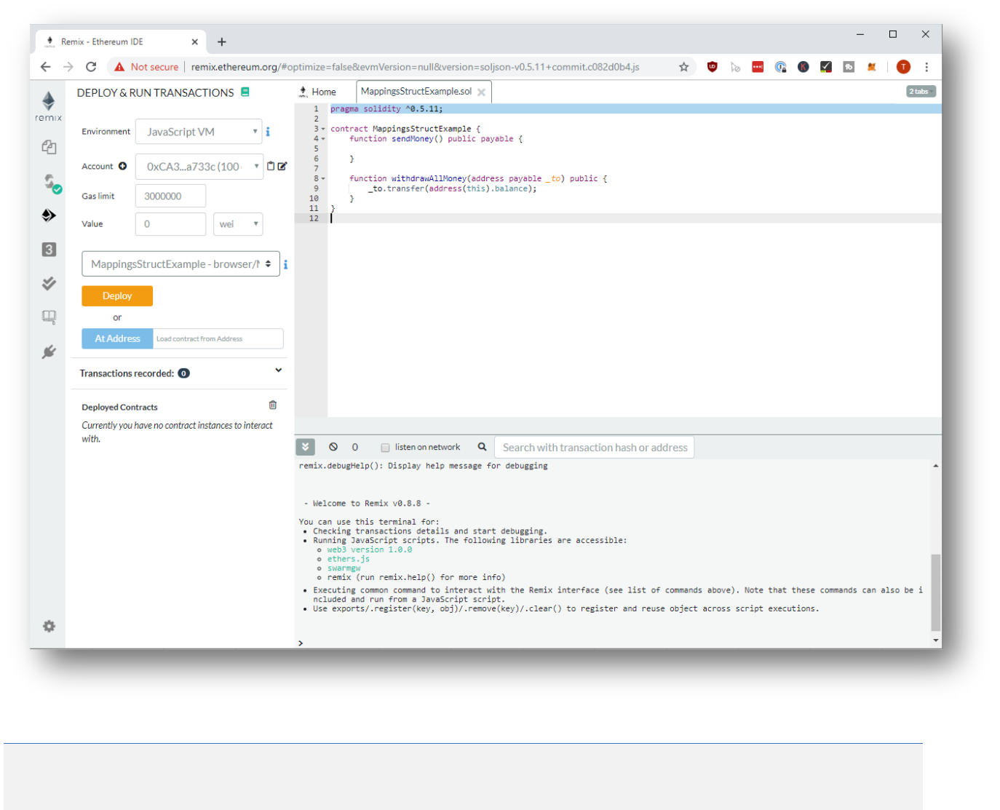
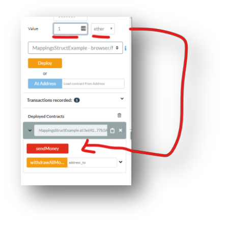
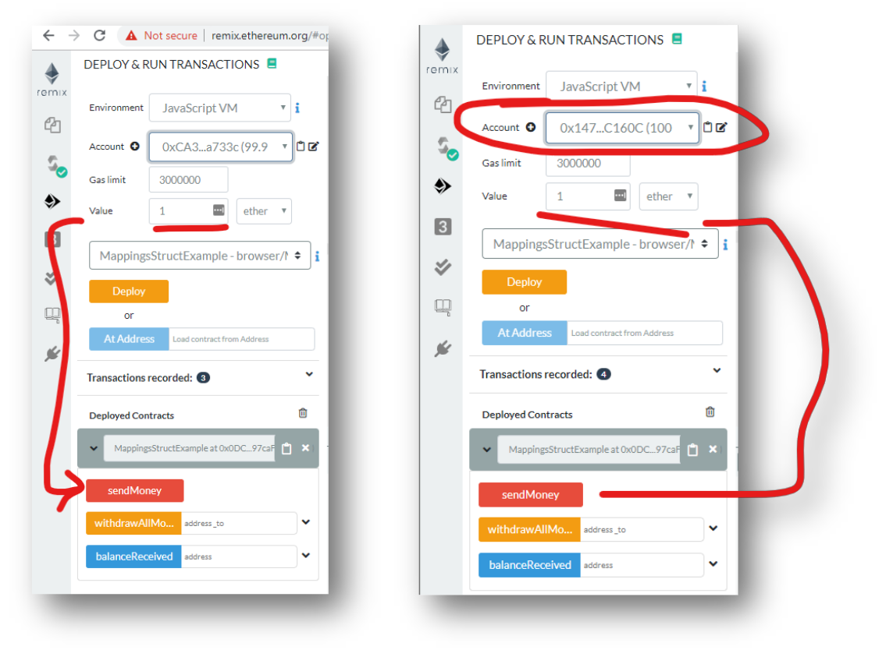
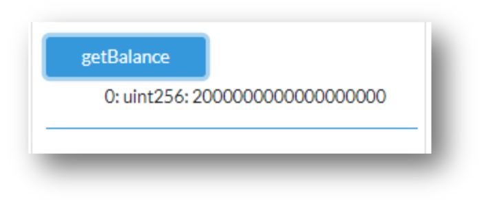
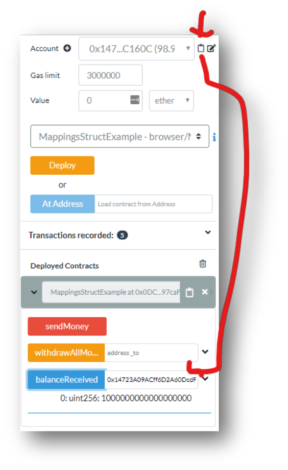
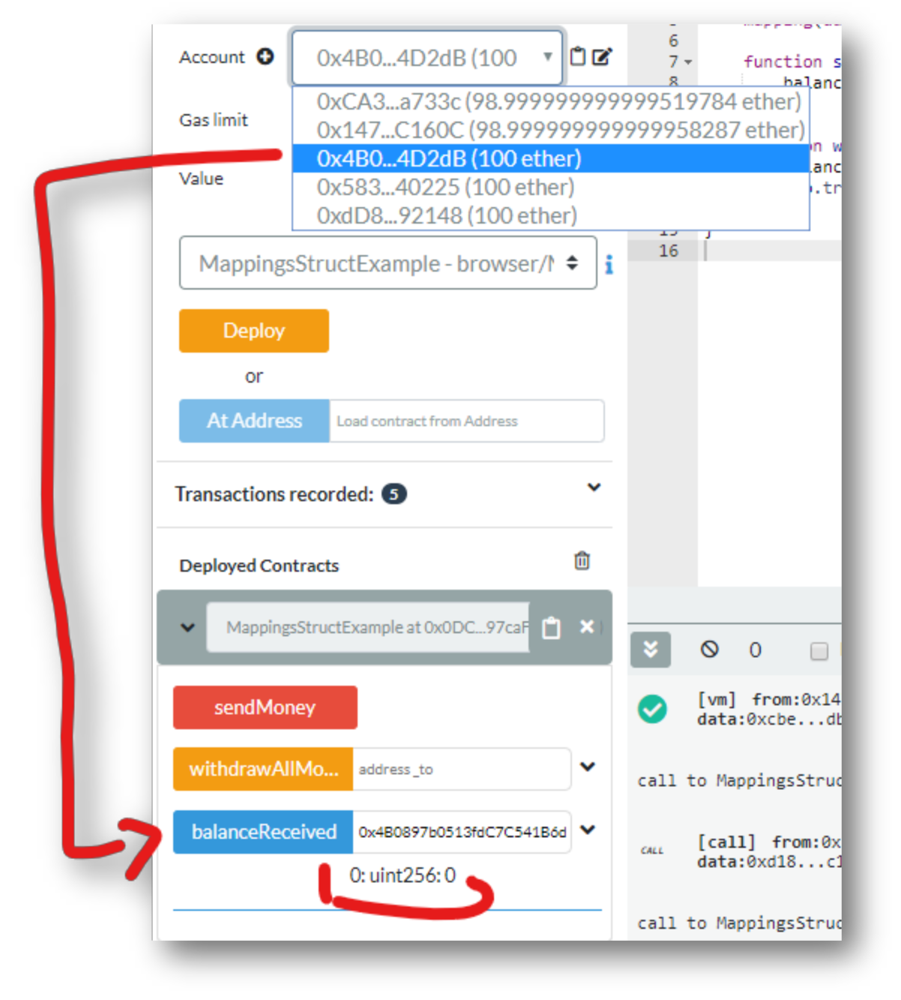
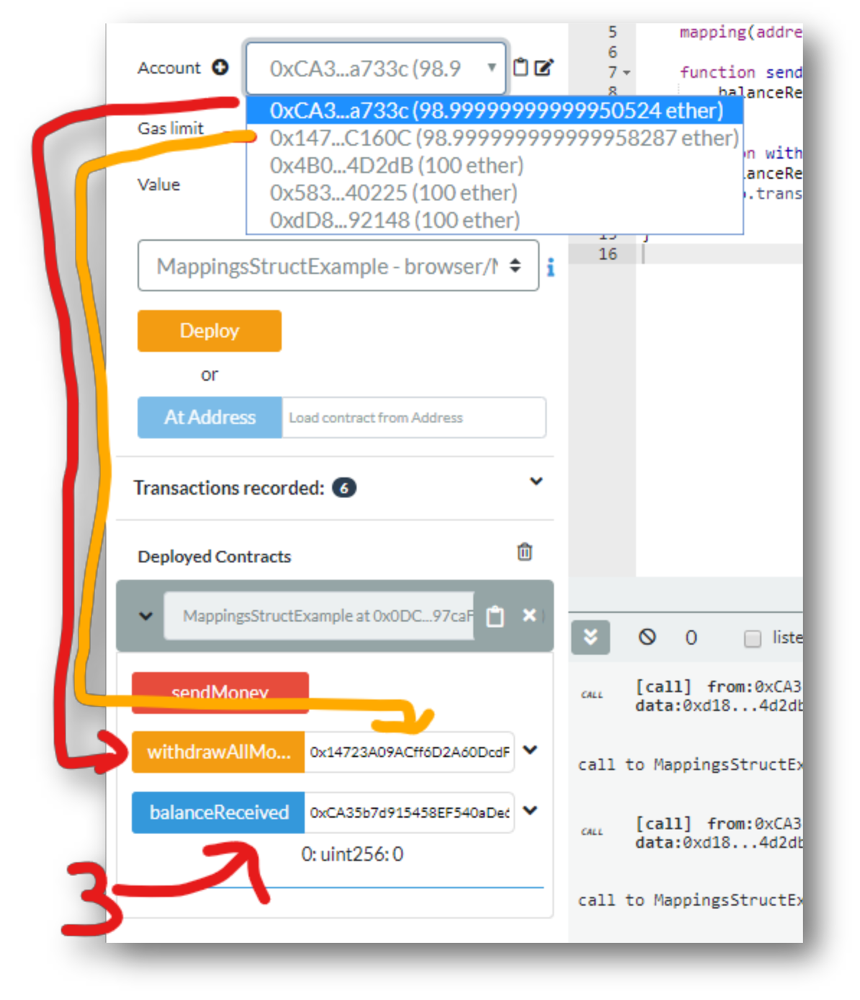
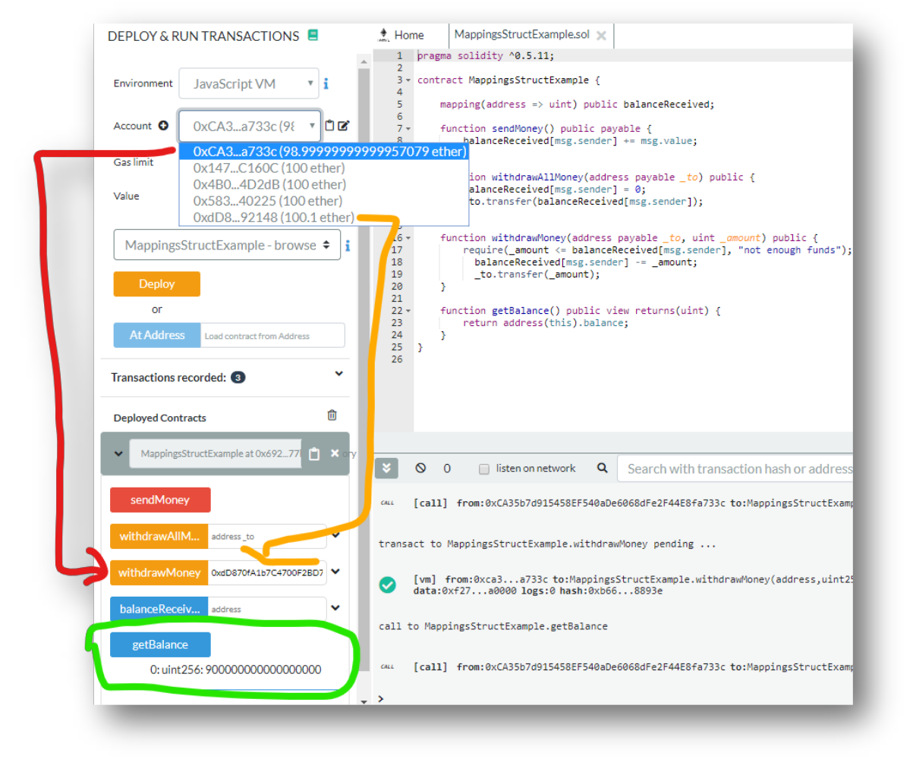
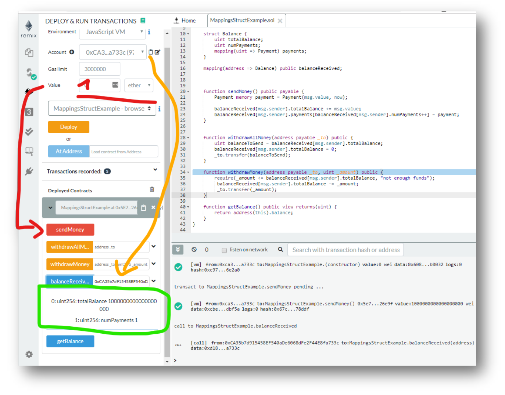

# Understanding `mapping` and `struct`

## Prerequisites
1. Chrome or Firefox browser.
2. An Internet connection
3. Open Remix with the following Smart Contract:

```js
// SPDX-License-Identifier: MIT

pragma solidity ^0.7.1;

contract MappingsStructExample {
    function getBalance() public view returns(uint) {
        return address(this).balance;
    }

    function sendMoney() public payable {
    }
    
    function withdrawAllMoney(address payable _to) public {
        _to.transfer(address(this).balance);
    }
}
```
## Step by Step Instruction

### Deploy the Smart Contract in the JavaScript VM

- Open the **Deploy and Run Transactions** view in Remix with the smart contract.



### Send some money to the Smart Contract

1. Deploy the Smart Contract and
2. send some money to the smart contract



### Withdraw the money from/to any account


- There are some options to make this more secure, like an `owner` or something similar. 
- But we can also make this inherently secure, by just letting people withdraw how much they spent!
- We can track this in a mapping!

### Add a Mapping

- Let’s add a simple mapping to our contract to track how much was deposited by whom.

- The additional steps in `withdrawAllMoney` might look confusing at first but stick with it. 
- It follows a so-called **checks-effects-interactions** pattern, you will hear later about more!

```js
// SPDX-License-Identifier: MIT

pragma solidity ^0.7.1;

contract MappingsStructExample {
    mapping(address => uint) public balanceReceived;

    function getBalance() public view returns(uint) {
        return address(this).balance;
    }

    function sendMoney() public payable {
        balanceReceived[msg.sender] += msg.value;
    }

    function withdrawAllMoney(address payable _to) public {
        uint balanceToSend = balanceReceived[msg.sender];
        balanceReceived[msg.sender] = 0;
        _to.transfer(balanceToSend);
    }
}
```

### Now send 1 Ether from two different Accounts

> Notice: Don’t forget to re-deploy the smart contract!



### Check the Balance of the Smart contract

- We sent 1 Ether from two accounts, so the total Balance should be 2 Ether:



### Check the Balance for Both Accounts

1. Copy the Address of your account#1 and enter it into the `balanceReceived` field.
2. Copy the address of your account#2 and enter it into the `balanceReceived` field.

You see that both can only withdraw the amount they sent to the smart contract, although the smart contract has 2 Ethers.



- If we use account#3 and check the balance, the balance is 0:



### Withdraw all the money from Account 1 to Account 2

1. Copy the Address of account #2
2. Switch to Account #1
3. Paste the address of account#2 in the `withdrawAllMoney` field



### Withdraw the Money from Account#2

Now Account#2 still has the funds. Can we withdraw those as well?
1. Copy the address of any of your accounts you want to send the money to.
2. Select account#2 from the Dropdown
3. Withdraw all the money to that account

### Add a function for partial withdrawals

Consider the following source code:

```js
// SPDX-License-Identifier: MIT

pragma solidity ^0.7.1;

contract MappingsStructExample {
    mapping(address => uint) public balanceReceived;

    function sendMoney() public payable {
        balanceReceived[msg.sender] += msg.value;
    }

    function withdrawAllMoney(address payable _to) public {
        uint balanceToSend = balanceReceived[msg.sender];
        balanceReceived[msg.sender] = 0;
        _to.transfer(balanceToSend);
    }

    function withdrawMoney(address payable _to, uint _amount) public {
        require(_amount <= balanceReceived[msg.sender], "not enough funds");
        balanceReceived[msg.sender] -= _amount;
        _to.transfer(_amount);
    }

    function getBalance() public view returns(uint) {
        return address(this).balance;
    }
}
```

### Partially withdraw 0.1 Ether to another Account

>Notice: For sake of better visibility I reloaded my browser window before executing these steps:

1. Redeploy the smart contract with the new code
2. Add 1 Ether from Account #1
3. Copy address of any of the other accounts in your account list
4. Paste it into the `withdrawMoney` field
5. Add a comma (field-separator)
6. Enter 100000000000000000 for 0.1 Ether (in Wei)
7. Confirm the withdrawal in both the Dropdown and the `Balance` function



### Add a Struct

- Structs are a great way to extend simple data-types. It’s like having an object, but much cheaper in terms
of gas-usage.
- Let’s add two structs and change our mapping so it uses these structs:

```js
struct Payment {
    uint amount;
    uint timestamp;
}

struct Balance {
    uint totalBalance;
    uint numPayments;
    mapping(uint => Payment) payments;
}

mapping(address => Balance) public balanceReceived;
```

- We have one struct called `Payment`, which stores the amount and the timestamp of the payment.
- Then we have another struct called `Balance` which stores the total balance and a `mapping` of all
payments done.
- Now we also have to update the `receiveMoney` function:

```js
function sendMoney() public payable {
    balanceReceived[msg.sender].totalBalance += msg.value;
    Payment memory payment = Payment(msg.value, now);
    balanceReceived[msg.sender].payments[balanceReceived[msg.sender].numPayments] = payment;
    balanceReceived[msg.sender].numPayments++;
}
```

- And we also have to update the withdrawal money function:

```js
function withdrawMoney(address payable _to, uint _amount) public {
    require(_amount <= balanceReceived[msg.sender].totalBalance, "not enough funds");
    balanceReceived[msg.sender].totalBalance -= _amount;
    _to.transfer(_amount);
}
```

- Now, obviously this doesn’t make much sense that we record payments but not withdrawals, but for the
sake of this tutorial it is ok. 
> In practice we don’t track Payments like this, we would use Events which we did not cover yet.

- From Solidity 0.6 onwards, struct can be declared at file level. It is still a good practice to place the struct
inside the contract. Only declare struct at the file level when you have multiple contracts in the file using
the same struct.

```js
// SPDX-License-Identifier: MIT

pragma solidity ^0.7.1;

struct Payment {
    uint amount;
    uint timestamp;
}

contract MappingsStructExample {
    struct Balance {
        uint totalBalance;
        uint numPayments;
        mapping(uint => Payment) payments;
    }

    mapping(address => Balance) public balanceReceived;
    mapping(address => uint) public balanceReceived;

    function sendMoney() public payable {
        balanceReceived[msg.sender] += msg.value;
    }

    function withdrawAllMoney(address payable _to) public {
        uint balanceToSend = balanceReceived[msg.sender];
        balanceReceived[msg.sender] = 0;
        _to.transfer(balanceToSend);
    }

    function withdrawMoney(address payable _to, uint _amount) public {
        require(_amount <= balanceReceived[msg.sender], "not enough funds");
        balanceReceived[msg.sender] -= _amount;
        _to.transfer(_amount);
    }

    function getBalance() public view returns(uint) {
        return address(this).balance;
    }
}
```

### Try the new struct

1. First, deposit one Ether
2. Then copy the address of your account
3. Then check if the balance adds up correctly



### Add a struct

- Structs are a great way to extend simple data-types. It’s like having an object, but much cheaper in terms
of gas-usage.
- Let’s add two structs and change our mapping so it uses these structs:

```js
struct Payment {
    uint amount;
    uint timestamp;
}

struct Balance {
    uint totalBalance;
    uint numPayments;
    mapping(uint => Payment) payments;
}

mapping(address => Balance) public balanceReceived;
```

- We have one struct called `Payment`, which stores the amount and the timestamp of the payment.
- Then we have another `struct` called `Balance` which stores the total balance and a `mapping` of all payments done.
- Now we also have to update the `receiveMoney` function:

```js
function sendMoney() public payable {
    balanceReceived[msg.sender].totalBalance += msg.value;
    Payment memory payment = Payment(msg.value, now);
    balanceReceived[msg.sender].payments[balanceReceived[msg.sender].numPayments] = payment;
    balanceReceived[msg.sender].numPayments++;
}
```

And we also have to update the `withdrawal` money function:

```js
function withdrawMoney(address payable _to, uint _amount) public {
    require(_amount <= balanceReceived[msg.sender].totalBalance, "not enough funds"); 
    balanceReceived[msg.sender].totalBalance -= _amount;
    _to.transfer(_amount);
}
```

> Now, obviously this doesn’t make much sense that we record payments but not withdrawals, but for the
sake of this tutorial it is ok. 

- In practice we don’t track Payments like this, we would use Events which we did not cover yet.
- From Solidity 0.6 onwards, `struct` can be declared at file level. It is still a good practice to place the struct
inside the contract. Only declare struct at the file level when you have multiple contracts in the file using
the same struct.

```js
// SPDX-License-Identifier: MIT

pragma solidity ^0.7.1;

struct Payment {
    uint amount;
    uint timestamp;
}

contract MappingsStructExample {
    struct Balance {
        uint totalBalance;
        uint numPayments;
        mapping(uint => Payment) payments;
    }

    mapping(address => Balance) public balanceReceived;
    mapping(address => uint) public balanceReceived;

    function sendMoney() public payable {
        balanceReceived[msg.sender] += msg.value;
    }

    function withdrawAllMoney(address payable _to) public {
        uint balanceToSend = balanceReceived[msg.sender];
        balanceReceived[msg.sender] = 0;
        _to.transfer(balanceToSend);
    }

    function withdrawMoney(address payable _to, uint _amount) public {
        require(_amount <= balanceReceived[msg.sender], "not enough funds");
        balanceReceived[msg.sender] -= _amount;
        _to.transfer(_amount);
    }

    function getBalance() public view returns(uint) {
        return address(this).balance;
    }
}
```

