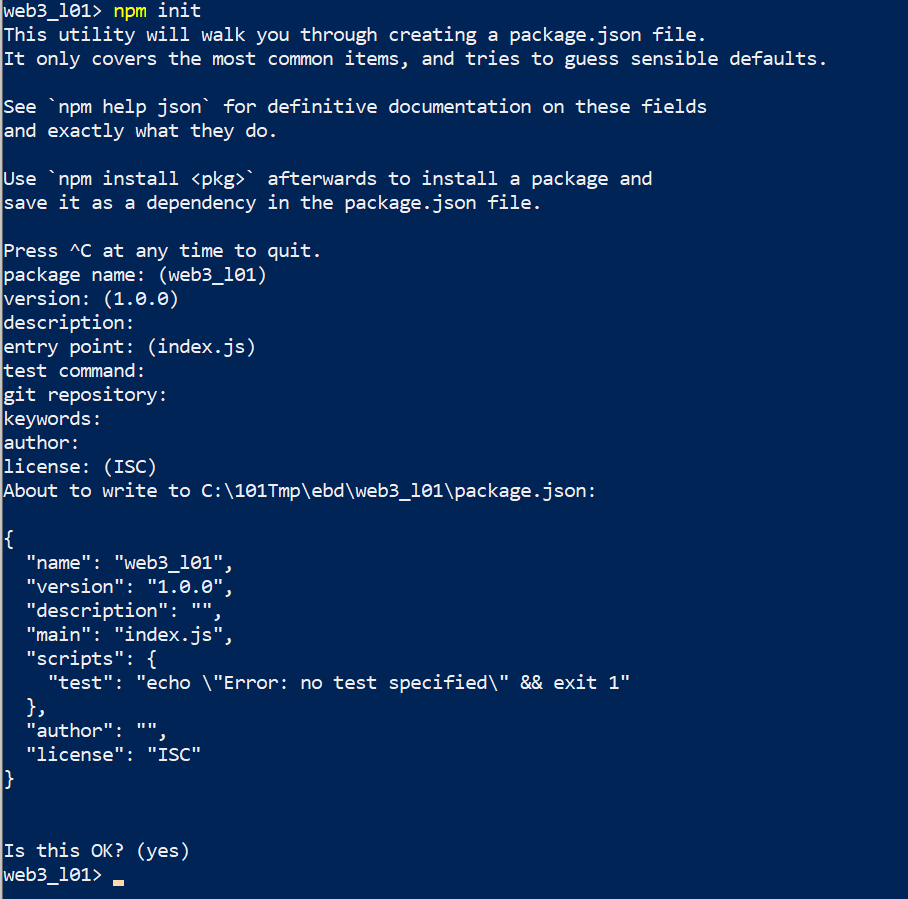
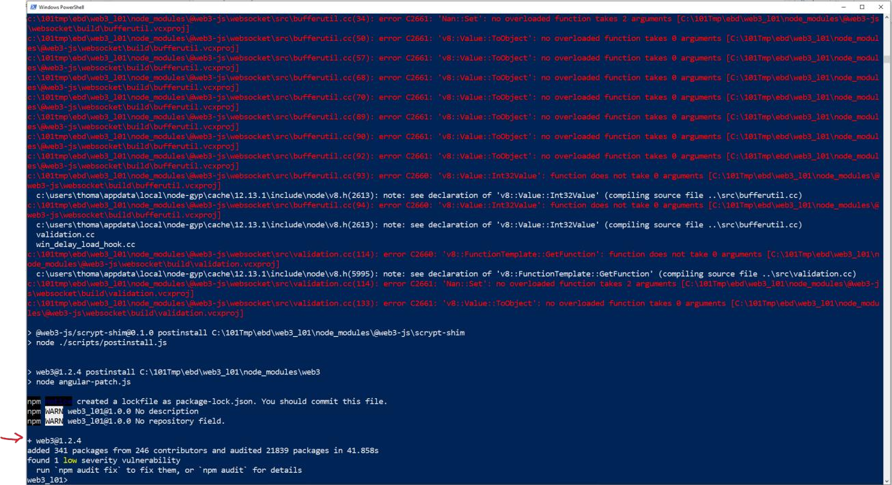
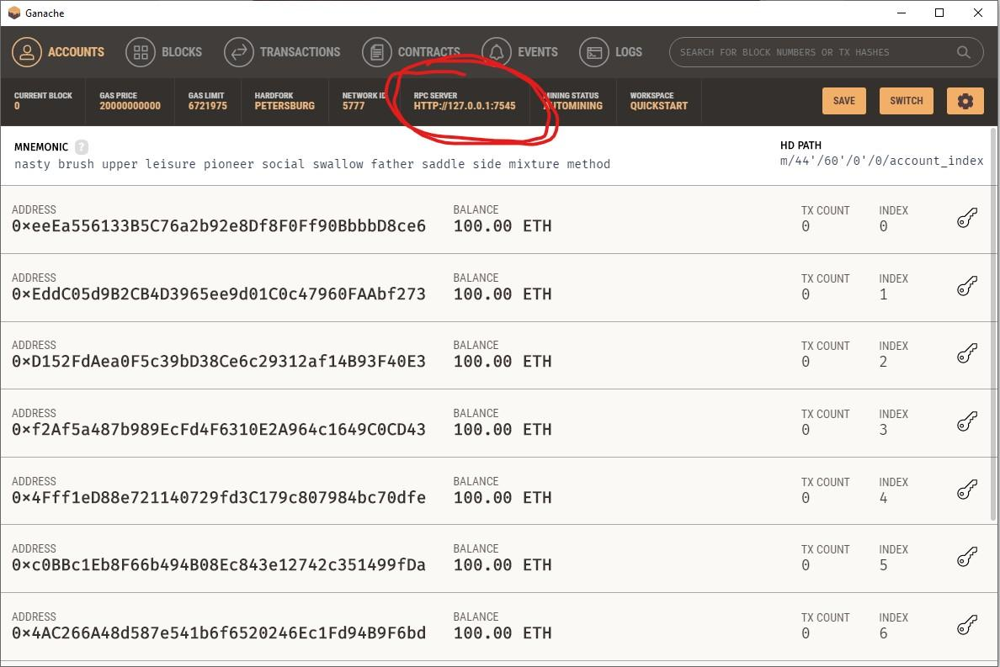
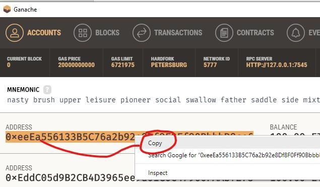
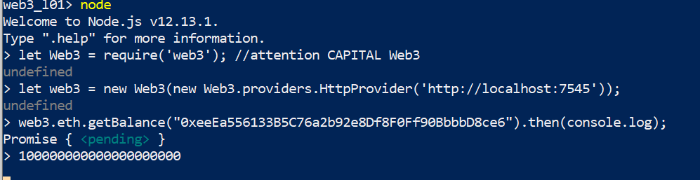
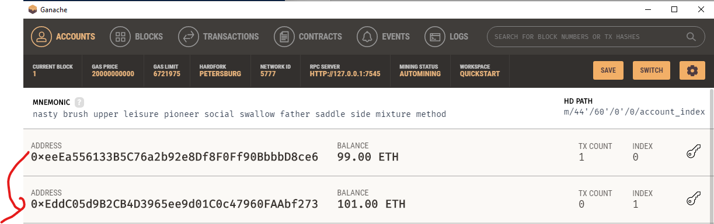
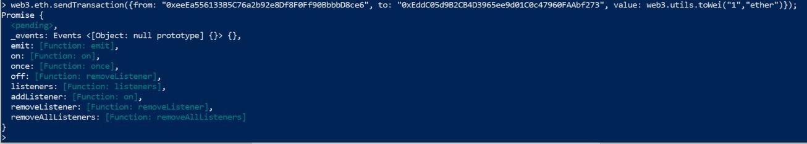

# Using Web3.js to Query the Balance

## Prerequisites

1. NodeJS and the Node Package Manager (npm) installed
2. Open Terminal (PowerShell on Windows)
3. Empty Directory
4. Ganache Installed (or any other blockchain node)

## Step by Step Instruction

### Initialize a new Directory

- Type in `npm init -y` and generate the package.json to initialize the current empty directory as node project.



### Install Web3.js

- Type in `npm install –save web3` to install `web3.js` in the current directory



### Start Ganache

- To interact with a blockchain node you need to start a blockchain node. In this we will run Ganache – but you can start any other blockchain node you want (geth, pantheon, parity). They all provide an RPC interface to interact with the node.

> Just be careful about the PORT! This might be different with different blockchain nodes:



### Start NodeJS Environment

- Start the NodeJS environment by typing in “node” in your terminal or command line


### Use web3.js to query the balance of one of your accounts

- First copy your Account Address:



- In the command line with node import web3:

```console
let Web3 = require('web3'); //attention CAPITAL Web3
let web3 = new Web3(new Web3.providers.HttpProvider('http://localhost:7545'));
web3.eth.getBalance("YOUR METAMASK ACCOUNT").then(console.log);
```

- Like so:



- It should output the amount in Wei from the Account on that Blockchain you are connected to.

### Send 1 Ether from Account 1 to Account 2

```console
web3.eth.sendTransaction({from: "ACCOUNT_ADDRESS_1"

, to: "ACCOUNT_ADDRESS_2"
,

value: web3.utils.toWei("1","ether")});
```






- If you followed along then you should have 1 ETH less in Account #1 and 1 ETH more in Account#2 (99 vs 101 ETH).

### Congratulations!!