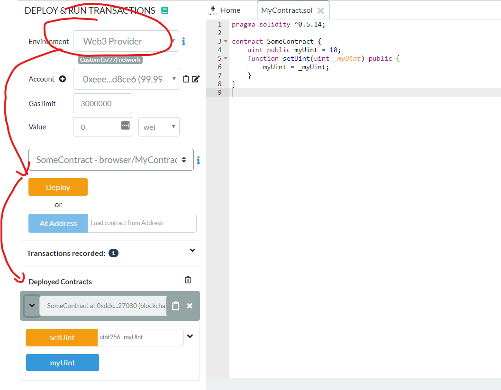
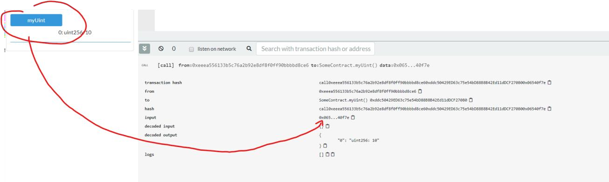
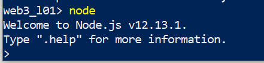
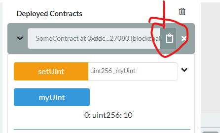
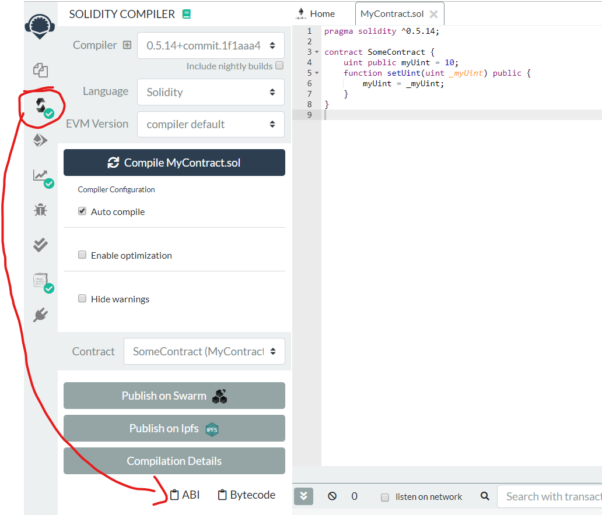
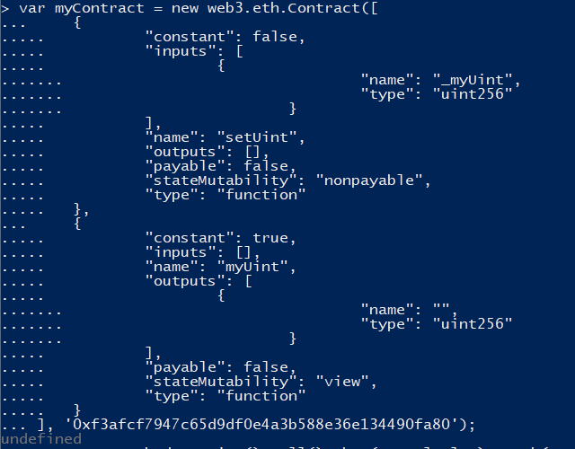
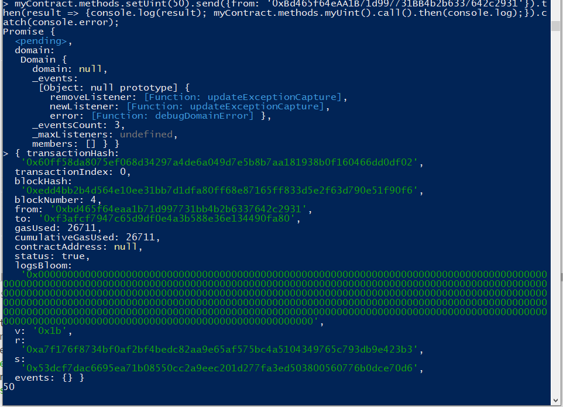

# Using Web3.js for Contract Interaction

## Prerequisites

1. NodeJS and the Node Package Manager (npm) installed
2. Open Terminal (PowerShell on Windows)
3. Directory with installed Web3 via npm
4. Ganache Open

## Step by Step Instruction

### Deploy a Smart Contract in Ganache

```js
// SPDX-License-Identifier: MIT

pragma solidity ^0.7.1;

contract SomeContract {
    uint256 public myUint = 10;

    function setUint(uint256 _myUint) public {
        myUint = _myUint;
    }
}
```

### Deploy the Smart Contract with Remix

- Choose the Web3-Provider in Remix! Port 7545 if you are using Ganache
- Then Deploy the Smart Contract.



### Interact with your Smart Contract

- In Remix call `myUint` and copy the data field content:



### Start NodeJS Environment

- Start the NodeJS environment by typing in “node” in your terminal or command line



### Use web3.js to interact with your Smart Contract on a very low level.

- In the command line with node import web3:

```console
const Web3 = require('web3'); //attention CAPITAL Web3
const web3 = new Web3(new
Web3.providers.HttpProvider('http://localhost:7545')); //ATTENTION THE PORT!
web3.eth.call({from: 'ACCOUNT_IN_GANACHE', to:'SMART_CONTRACT_ADDRESS',
data:'0x06540f7e'}).then(console.log);
```

- You get the SMART_CONTRACT_ADDRESS by copying it from Remix:



- If everything works as expected it should output
`0x000000000000000000000000000000000000000000000000000000000000000a`


- Which is 10 in hex format padded to 256 bit or 32 byte or 64 hex characters.
- Now we know that `0x06540f7e` sent as data field is interacting with the function `myUint`
- The encoding happens in a very specific way: It’s the first 4 bytes of the `keccak` hash of the function
signature.
- In other words: `bytes4(keccack256(myUint()))`
- Give it a try in node where we have access to `web3.utils.sha3` which give us the keccak hash:
```console
web3.utils.sha3(myUint())
```
Which gives:
`0x06540f7eac53ad8a460dca00c89ac4438982ca36ff3248355f14b688948f672a`
- Now we need the first 4 bytes of the hex encoded hash:
```console
web3.utils.sha3("myUint()").substr(0,10);
```
- The result is exactly our data-field. We need this because in the compiled bytecode of our smart contract there is no `myUint()` as a function definition. Instead it’s a jump statement to the right position in the code! And this is the function definition.
- Whenever we interact with our smart contract from outside, we need to know the function names to generate these signatures as data-fields. This is where the ABI array comes in. The Application Binary
Interface is a json encoded array with all the information needed to encode the data field the right way.

### Update myUint using the ABI Array

- Let’s use the ABI Array now to interact in an easier way with our smart contract.
- Copy the ABI Array from Remix:



- And enter the following code in node:

```console
var myContract = new web3.eth.Contract(PASTE_ABI_ARRAY_HERE,
'CONTRACT_ADDRESS');
```



- Then simply call via a very declarative function name:
`myContract.methods.myUint().call().then(console.log).catch(console.error);`
- Now let’s update the uint and call it again afterwards. But for this we must actually send off a transaction to our ganache. Web3 doesn’t know which is the account we want to send the transaction from, so we
have to set this first:

- Then, once the transaction is mined (on Ganache instantaneously, but on a real network it might take 10-20 seconds), we read out the updated value.

```console
myContract.methods.setUint(50).send({from:
'FIRST_ACCOUNT_FROM_GANACHE'}).then(result => {console.log(result);
myContract.methods.myUint().call().then(console.log);}).catch(console.error);
```



>No matter how complicated the smart contract is, with the ABI Array and Web3 you can easily interact with it. You will see later that it’s all just like calling a JavaScript function and all the technical part is
abstracted away from you.

#### Congratulations!

