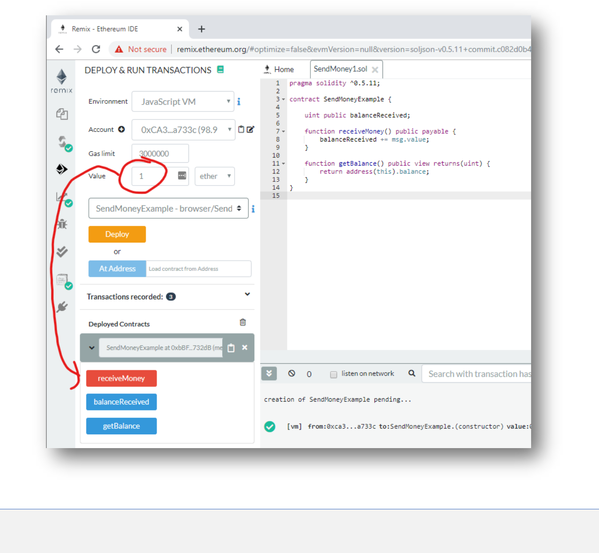
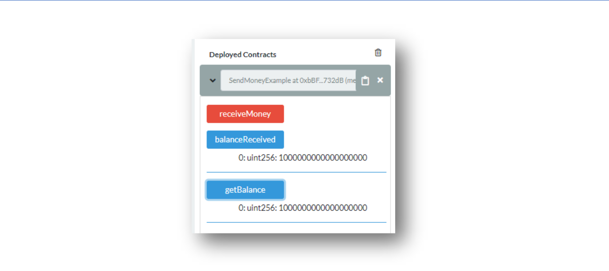
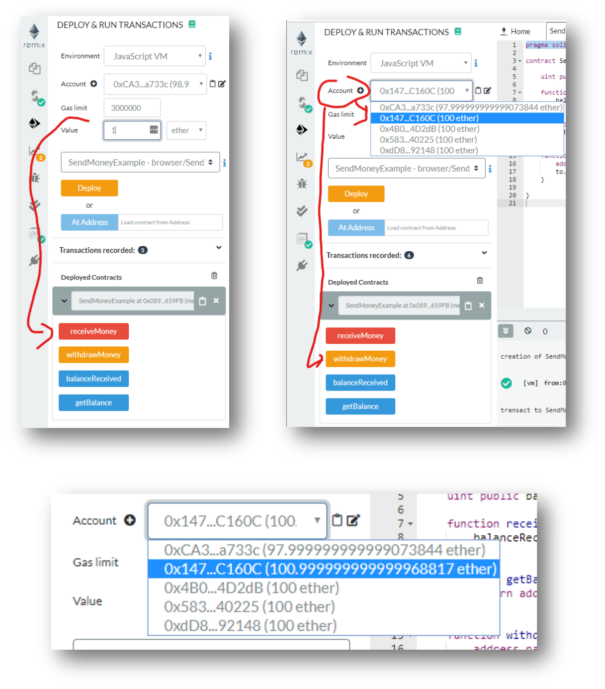
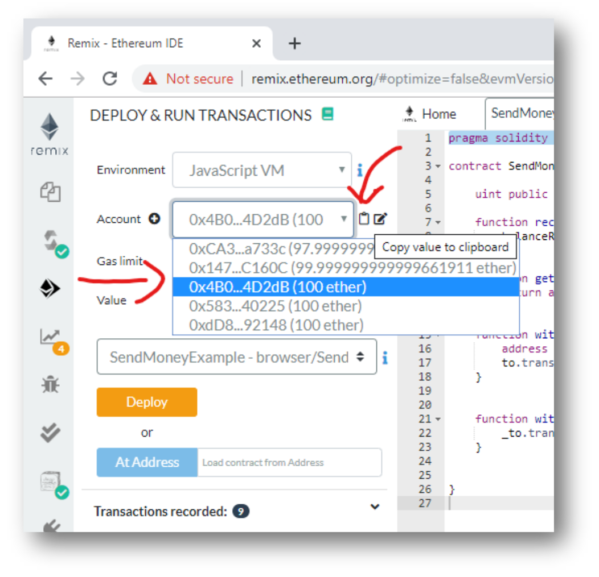
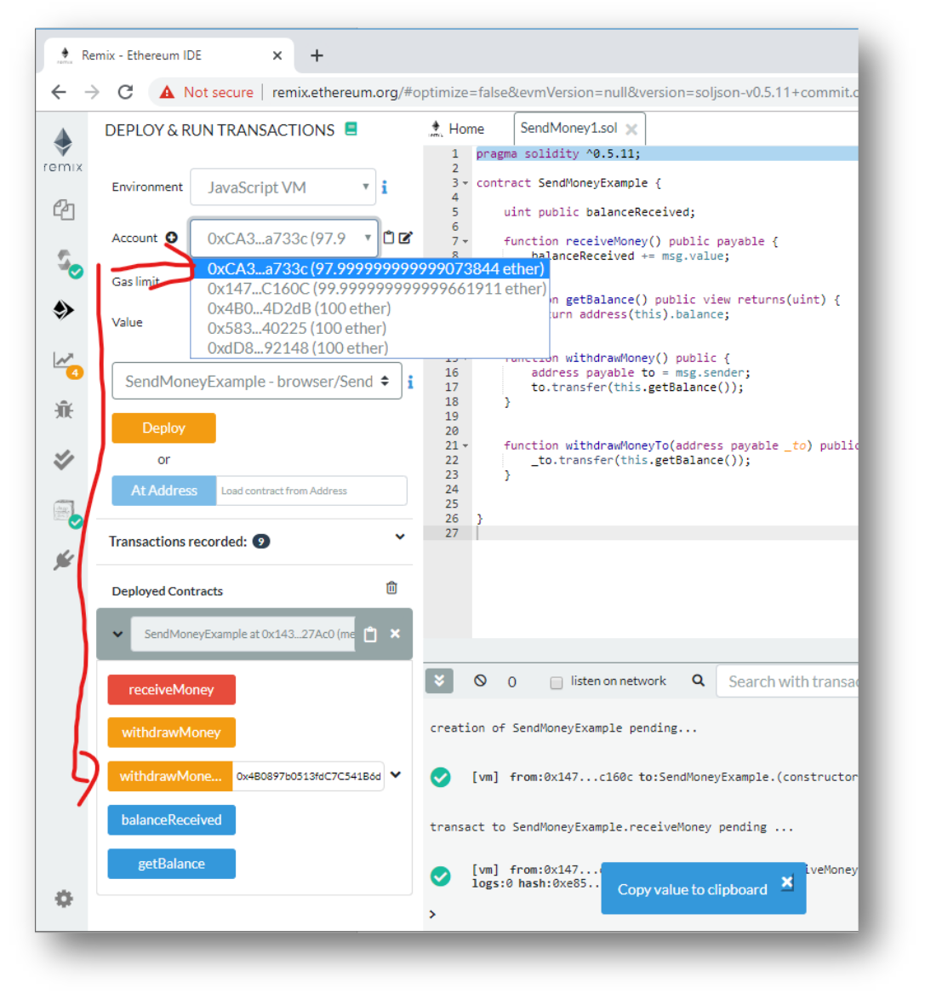

# Accounts and Addresses

## Prerequisites
1. Chrome or Firefox browser.
2. An Internet connection

### Open Remix with the following Smart Contract:

```js
// SPDX-License-Identifier: MIT

pragma solidity ^0.7.1;

contract SendMoneyExample {
    uint public balanceReceived;

    function receiveMoney() public payable {
        balanceReceived += msg.value;
    }

    function getBalance() public view returns(uint) {   
        return address(this).balance;
    }
}
```

## Step by Step Instruction

### Deploy the Smart Contract in the JavaScript VM

Open the **Deploy and Run Transactions** view in Remix with the smart contract


### Send some money to the Smart Contract



### Get the Balance of the Smart Contract Address



### We add a Witdrawal-Function

```js
// SPDX-License-Identifier: MIT

pragma solidity ^0.7.1;

contract SendMoneyExample {
    uint public balanceReceived;

    function receiveMoney() public payable {
        balanceReceived += msg.value;
    }

    function getBalance() public view returns(uint) {
        return address(this).balance;
    }

    function withdrawMoney() public {
        address payable to = msg.sender;
        to.transfer(this.getBalance());
    }
}
```

### Use the new Withdrawal function

>Note: Don’t forget, first you need to deploy a new version of the smart contract andyou can close the previous Instance.

- First send again 1 Ether to the smart contract. Then switch the account and withdraw that Ether!



### Add a function to withdraw money to a given address

```js
// SPDX-License-Identifier: MIT

pragma solidity ^0.7.1;

contract SendMoneyExample {
    uint public balanceReceived;

    function receiveMoney() public payable {
        balanceReceived += msg.value;
    }

    function getBalance() public view returns(uint) {
        return address(this).balance;
    }

    function withdrawMoney() public {
        address payable to = msg.sender;
        to.transfer(this.getBalance());
    }

    function withdrawMoneyTo(address payable _to) public {
        _to.transfer(this.getBalance());
    }
}
```

### Withdraw money to an arbitrary address

- First deploy the new instance. Then send 1 Ether to the new instance. Then copy the address of some account:



- Then paste it and use any other account from the accounts-dropdown to send the transaction:



#### Congratulations!