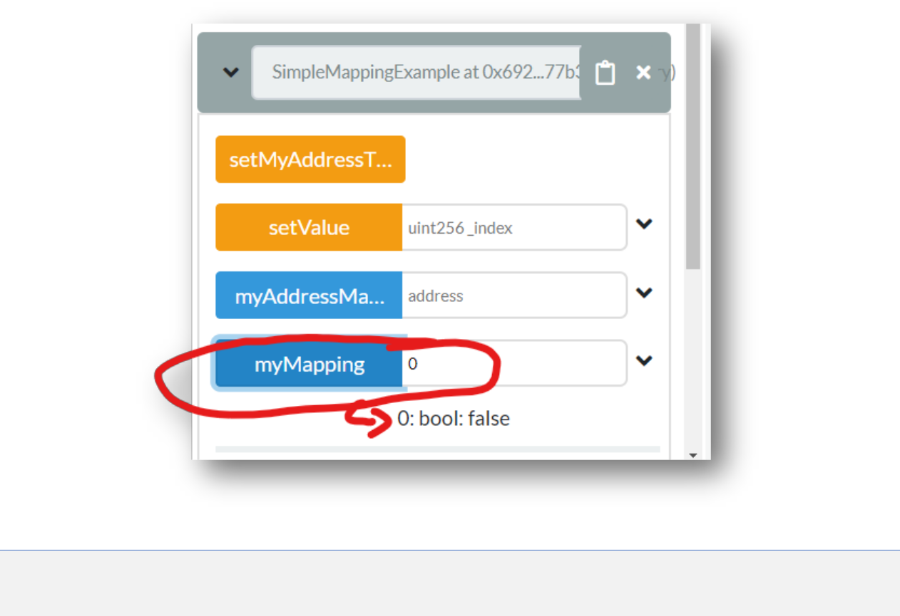
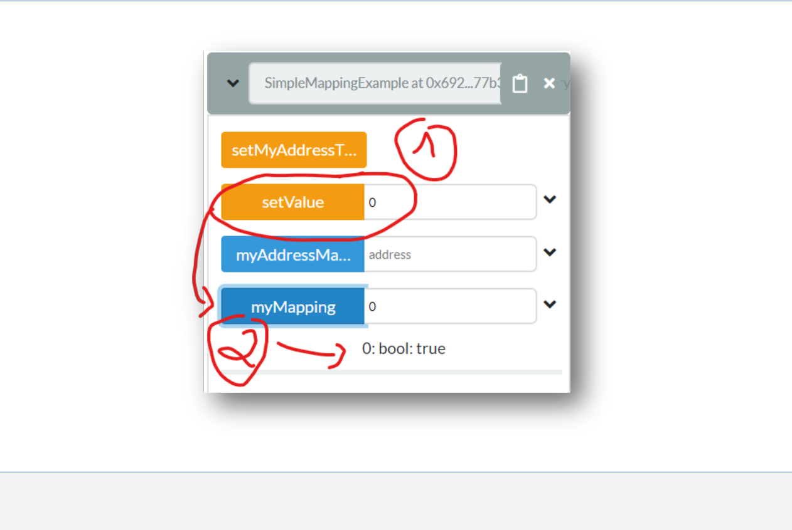
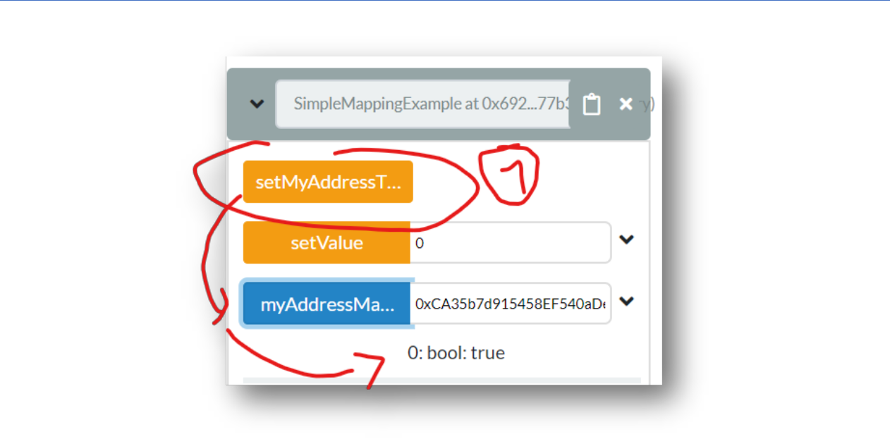

# Understanding Mappings Intro

## Prerequisites
1. Chrome or Firefox browser.
2. An Internet connection
3. Open Remix with the following Smart Contract:

```js
// SPDX-License-Identifier: MIT

pragma solidity ^0.7.1;

contract SimpleMappingExample {
    mapping(uint => bool) public myMapping;
    mapping(address => bool) public myAddressMapping;

    function setValue(uint _index) public {
        myMapping[_index] = true;
    }

    function setMyAddressToTrue() public {
        myAddressMapping[msg.sender] = true;
    }
}
```

## Step by Step Instruction

### Deploy the Smart Contract in the JavaScript VM

- Open the **Deploy and Run Transactions** view in Remix with the smart contract

### Check the `uint => bool` mapping Value



### Update the `uint => bool` mapping value



### Check your Account Value


### Update your Account Value and Re-Check it



#### Congratulations!