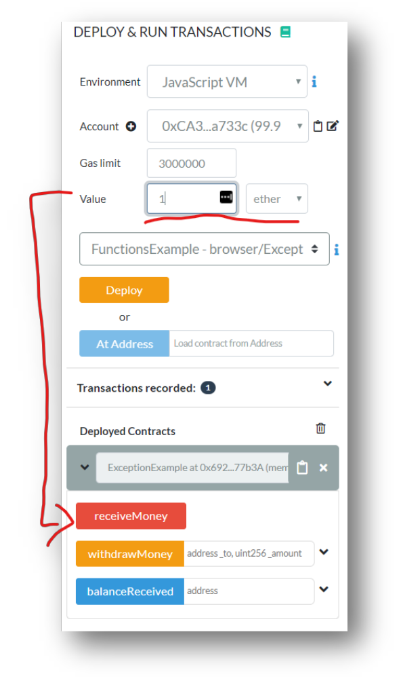
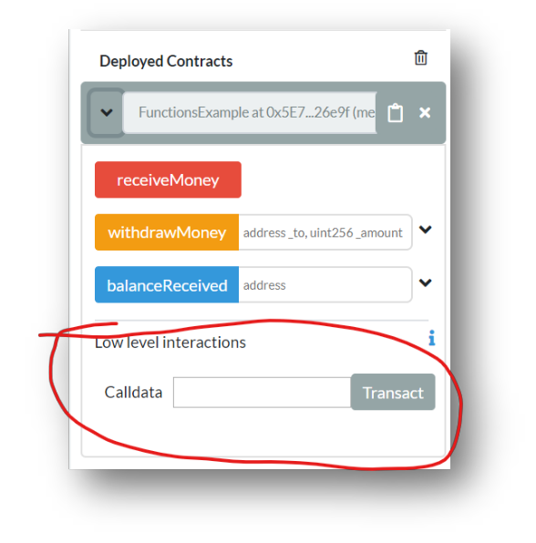
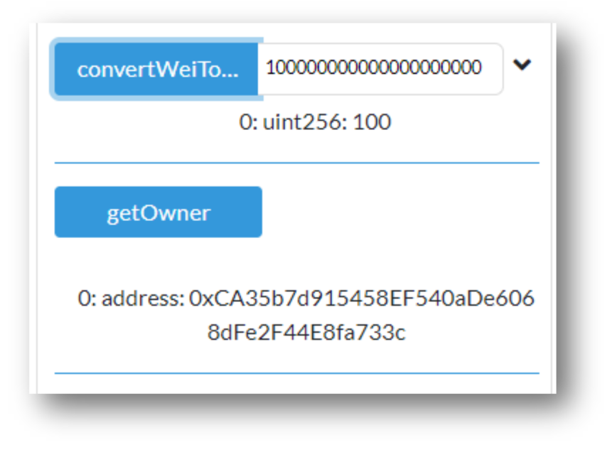

# View/Pure Functions, Constructor and Fallback Function

## Prerequisites
1. Chrome or Firefox browser.
2. An Internet connection
3. Open Remix with the following Smart Contract:

```js
// SPDX-License-Identifier: MIT

pragma solidity ^0.7.1;

contract FunctionsExample {

    mapping(address => uint) public balanceReceived;

    function receiveMoney() public payable {
        assert(balanceReceived[msg.sender] + msg.value >= balanceReceived[msg.sender]);
        balanceReceived[msg.sender] += msg.value;
    }

    function withdrawMoney(address payable _to, uint _amount) public {
        require(_amount <= balanceReceived[msg.sender], &quot;not enough funds.&quot;);
        assert(balanceReceived[msg.sender] >= balanceReceived[msg.sender] - _amount);
        balanceReceived[msg.sender] -= _amount;
        _to.transfer(_amount);
    }
}
```

> ATTENTION! The fallback function has changed in Solidity 0.6. It is no longer a no-name function, it is
now two functions, depending on the use case:

```js
fallback () …
receive () …
```
The code in this document has been updated, but please also watch the Solidity 0.6 update walkthrough
in the course at the end of the current section before proceeding.

## Step by Step Instruction

### Deploy the Smart Contract in the JavaScript VM

- Open the **Deploy and Run Transactions** view in Remix with the smart contract

### Deposit 1 Ether

- If you deposit `1 ether`, you have to do it using the function call to `receiveMoney`.



- The problem with that is, that you can’t send just a plain transaction to the smart contract.

### Add an anonymous function

```js
// SPDX-License-Identifier: MIT

pragma solidity ^0.7.1;

contract FunctionsExample {

    mapping(address => uint) public balanceReceived;

    function receiveMoney() public payable {
        assert(balanceReceived[msg.sender] + msg.value >= balanceReceived[msg.sender]);
        balanceReceived[msg.sender] += msg.value;
    }

    function withdrawMoney(address payable _to, uint _amount) public {
        require(_amount <= balanceReceived[msg.sender], "not enough funds.");
        assert(balanceReceived[msg.sender] >= balanceReceived[msg.sender] - _amount);
        balanceReceived[msg.sender] -= _amount;
        _to.transfer(_amount);
    }

    receive() external payable {
        receiveMoney();
    }
}
```

- Now when you deploy your smart contract you will get a new function called “low level interactions”, with the option to enter arguments although our function doesn’t have any arguments:



- The fallback function is called whenever the smart contract is called “as-is”, or if no other function matches.
- The `fallback` function is called when no other function matches and no money is sent along.
- The `receive` function matches when no other function matches and money is sent along.

### Add a function to destroy the smart contract

```js
// SPDX-License-Identifier: MIT

pragma solidity ^0.7.1;

contract FunctionsExample {
    mapping(address => uint) public balanceReceived;
    address payable owner;

    constructor() public {
        owner = msg.sender;
    }

    function destroySmartContract() public {
        require(msg.sender == owner, "You are not the owner");
        selfdestruct(owner);
    }

    function receiveMoney() public payable {
        assert(balanceReceived[msg.sender] + msg.value >= balanceReceived[msg.sender]);
        balanceReceived[msg.sender] += msg.value;
    }

    function withdrawMoney(address payable _to, uint _amount) public {
        require(_amount >= balanceReceived[msg.sender], "not enough funds.");
        assert(balanceReceived[msg.sender] >= balanceReceived[msg.sender] - _amount);
        balanceReceived[msg.sender] -= _amount;
        _to.transfer(_amount);
    }

    receive () external payable {

        receiveMoney();
    }

}
```

- If we re-deploy the smart contract then the address `owner` is set automatically through the `constructor`, but the constructor can not be called anymore. We can call the new `destroySmartContract` function, but we can’t call the constructor again.

### Add a `view` and a `pure` Function

```js
    //...
    address payable owner;

    function getOwner() public view returns(address) {
        return owner;
    }

    function convertWeiToEth(uint _amountInWei) public pure returns(uint) {
        return _amountInWei / 1 ether;
    }
//...
```

- If you deploy the smart contract with the new functions, you can retrieve the owner with a custom getter function and you can convert wei to ether.
- `pure` functions can not read from state or modify the state in any way.
- `view` function can read from state but not modify the state.
- Both are free, because reading only applies to your local copy of the blockchain. There is no need for mining.



#### Congratulations!