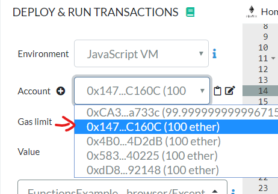
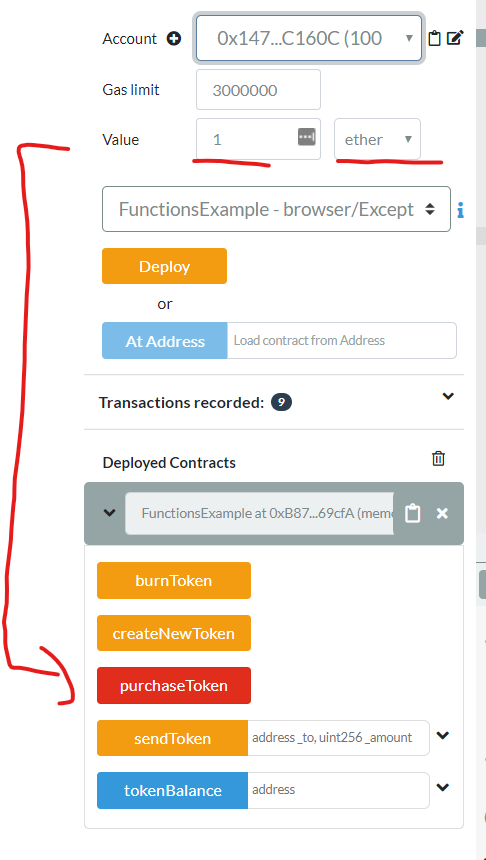
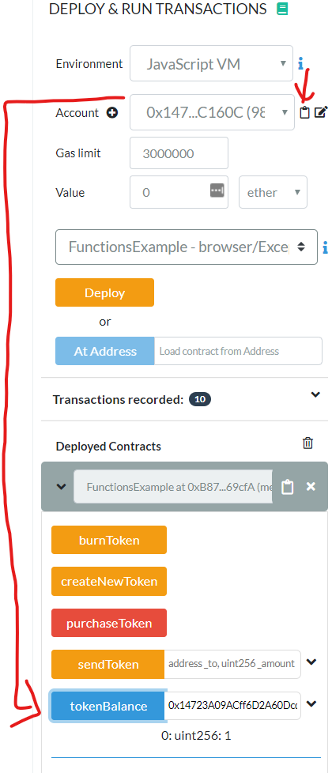
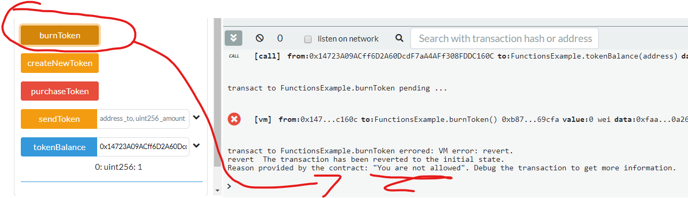
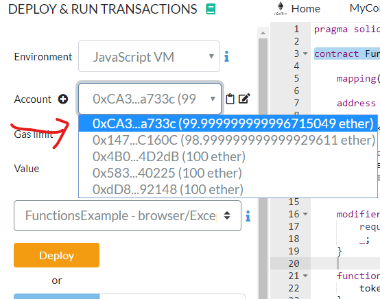
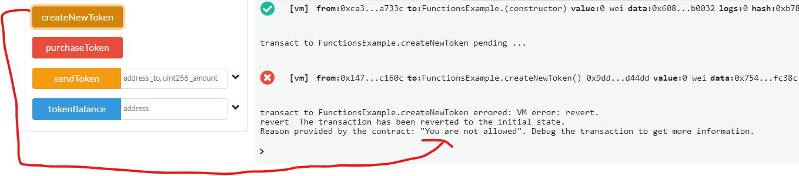
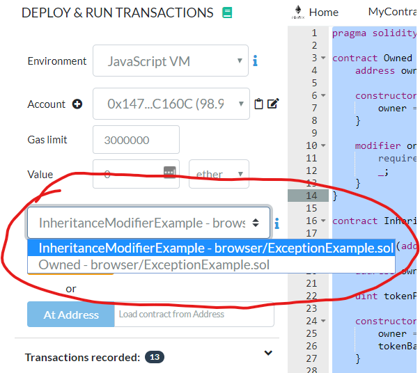
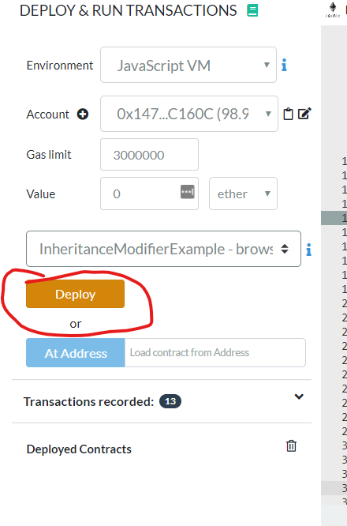
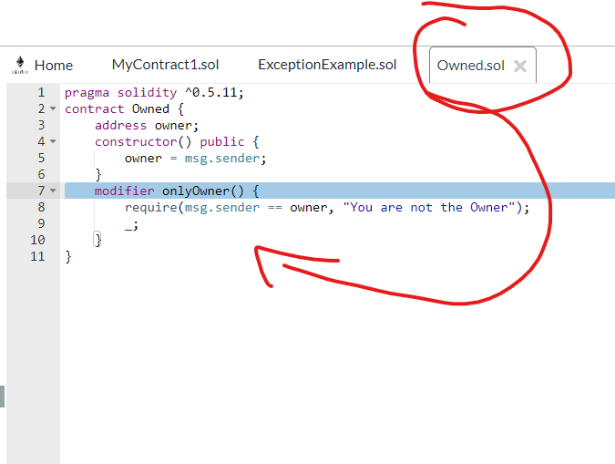

# Inheritance, Modifier, Importing

## Prerequisites

1. Chrome or Firefox browser.
2. An Internet connection
3. Open Remix with the following Smart Contract:

```js
// SPDX-License-Identifier: MIT

pragma solidity ^0.7.1;

contract InheritanceModifierExample {
    mapping(address => uint256) public tokenBalance;
    address owner;
    uint256 tokenPrice = 1 ether;

    constructor() {
        owner = msg.sender;
        tokenBalance[owner] = 100;
    }

    function createNewToken() public {
        require(msg.sender == owner, "You are not allowed");
        tokenBalance[owner]++;
    }

    function burnToken() public {
        require(msg.sender == owner, "You are not allowed");
        tokenBalance[owner]--;
    }

    function purchaseToken() public payable {
        require(
            (tokenBalance[owner] * tokenPrice) / msg.value > 0,
            "not enough tokens"
        );
        tokenBalance[owner] -= msg.value / tokenPrice;
        tokenBalance[msg.sender] += msg.value / tokenPrice;
    }

    function sendToken(address _to, uint256 _amount) public {
        require(tokenBalance[msg.sender] >= _amount, "Not enough tokens");
        assert(tokenBalance[_to] + _amount >= tokenBalance[_to]);
        assert(tokenBalance[msg.sender] - _amount <= tokenBalance[msg.sender]);
        tokenBalance[msg.sender] -= _amount;
        tokenBalance[_to] += _amount;
    }
}
```

## Step by Step Instruction

### Deploy the Smart Contract in the JavaScript VM

- Open the “Deploy and Run Transactions” view in Remix with the smart contract. Deploy the Smart Contract using your Account #1 from the accounts-dropdown


### Buy 1 Token

- Use Account#2 from your dropdown to Buy one Token from the Owner




### Check the Token Balance



- Great! You can buy Tokens. But can you also call the burnToken function from Account#2?

### Try to burn a token with Account#2



> You cannot, because in the code only the owner of the smart contract can do this. But it is error prone to have `require(msg.sender == owner)` in all functions. We can do better than this!

### Add a modifier!

```js
//...
modifier onlyOwner {
        require(msg.sender == owner, "You are not allowed");
        _;
    }
//...
```
- Then change the functions burnToken and createNewToken to:

```js
//...
function createNewToken() public onlyOwner {
    tokenBalance[owner]++;
}

function burnToken() public onlyOwner {
    tokenBalance[owner]--;
}
//...
```

### Re-Deploy the Smart Contract and Test

- Redeploy your smart contract with account#1 from the accounts-dropdown



- Then **switch over to account#2** and try to call createNewToken:



### Move the functions to an external Smart Contract

```js
// SPDX-License-Identifier: MIT

pragma solidity ^0.7.1;

contract Owned {
    address owner;

    constructor() {
        owner = msg.sender;
    }

    modifier onlyOwner {
        require(msg.sender == owner, "You are not allowed");
        _;
    }
}

contract InheritanceModifierExample is Owned {
    mapping(address => uint256) public tokenBalance;
    // address owner; // it is already declared
    uint256 tokenPrice = 1 ether;

    constructor() {
        // owner = msg.sender; // it is already declared
        tokenBalance[owner] = 100;
    }

    function createNewToken() public onlyOwner {
        tokenBalance[owner]++;
    }

    //... more code here ...
```

### Deploy and Test

- Re-Test the whole thing: Deploy with account#1 and test with account#2.
- Be aware that there are two contracts now in your contract-dropdown. You just have to deploy the “InheritanceModifierExample” contract, since the “Owned” Smart contract gets compiled into the binary code




### Put the “Owned” Contract into its own file

- First Create a new file



- Then import from owned.sol:

```js
// SPDX-License-Identifier : MIT

pragma solidity ^0.7.1;

import "./Owned.sol";

contract InheritanceModifierExample is Owned {
    mapping(address => uint256) public tokenBalance;
    uint256 tokenPrice = 1 ether;

    constructor() public {
        tokenBalance[owner] = 100;
    }

    function createNewToken() public onlyOwner {
        tokenBalance[owner]++;
    }
    //... more code here ...
```

#### Congratulations!