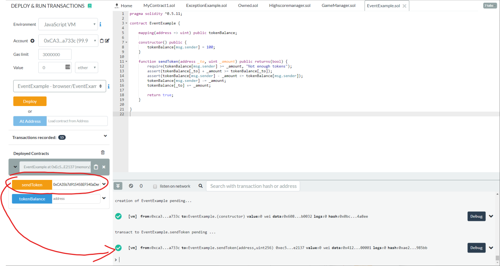
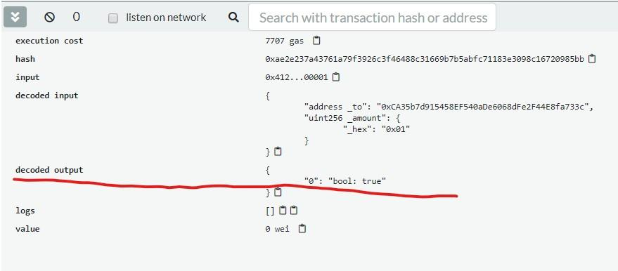
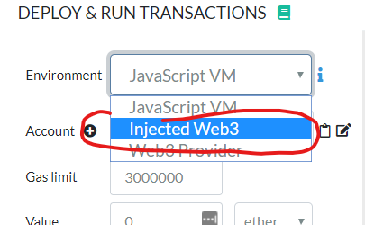
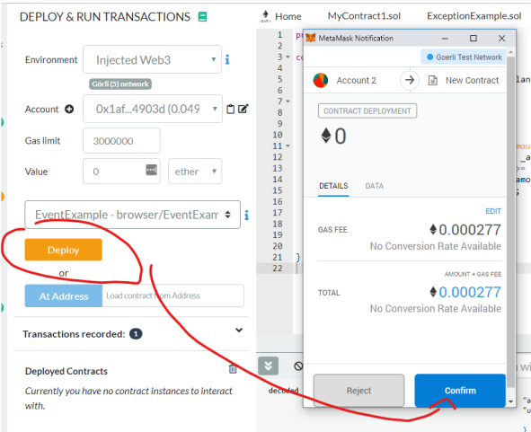
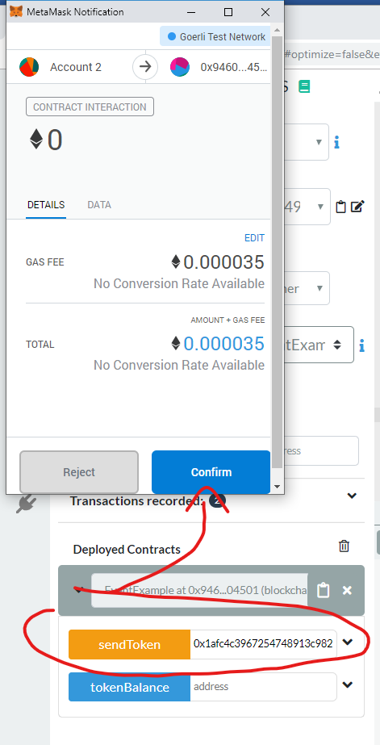
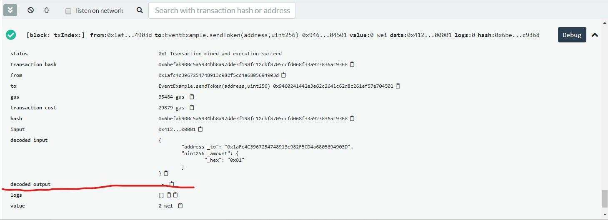
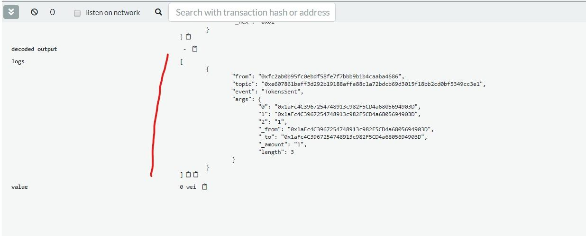

# Events and Return Variables

## Prerequisites

1. Chrome or Firefox browser.
2. An Internet connection
3. Open Remix with the following Smart Contract:

```js
// SPDX-License-Identifier: MIT

pragma solidity ^0.7.1;

contract EventExample {
    mapping(address => uint256) public tokenBalance;

    constructor() {
        tokenBalance[msg.sender] = 100;
    }

    function sendToken(address _to, uint256 _amount) public returns (bool) {
        require(tokenBalance[msg.sender] >= _amount, "Not enough tokens");
        assert(tokenBalance[_to] + _amount >= tokenBalance[_to]);
        assert(tokenBalance[msg.sender] - _amount <= tokenBalance[msg.sender]);
        tokenBalance[msg.sender] -= _amount;
        tokenBalance[_to] += _amount;
        return true;
    }
}
```

## Step by Step Instruction

### Deploy the Smart Contract in the JavaScript VM

- Open the “Deploy and Run Transactions” view in Remix with the smart contract. Deploy the Smart Contract!

### Send 1 Token to any account

- Send 1 token and observe what happens with the return value:



- If you open the details, you can see the return value.



>Unfortunately, this doesn’t work on real blockchains! 

- Try to deploy the same using MetaMask and your previously acquired Test-Ether

### Deploy on Görli or Ropsten Test-Network




- Wait until the transaction is mined... Then try again to send 1 Token.



- As soon as the transaction is mined you will not see an output, it’s empty.



- Return values are meant for inter-smart-contract communication, they won’t return anything to the transaction origin. This is why we have to use Events for outputting anything in writing transactions.

### Add an Event to the Smart Contract

```js
// SPDX-License-Identifier: MIT

pragma solidity ^0.7.1;

contract EventExample {
    mapping(address => uint256) public tokenBalance;
    event TokensSent(address _from, address _to, uint256 _amount);

    constructor() {
        tokenBalance[msg.sender] = 100;
    }

    function sendToken(address _to, uint256 _amount) public returns (bool) {
        require(tokenBalance[msg.sender] >= _amount, "Not enough tokens");
        assert(tokenBalance[_to] + _amount >= tokenBalance[_to]);
        assert(tokenBalance[msg.sender] - _amount <= tokenBalance[msg.sender]);
        tokenBalance[msg.sender] -= _amount;
        tokenBalance[_to] += _amount;
        emit TokensSent(msg.sender, _to, _amount);
        return true;
    }
}
```

- Re-Deploy to Görli or any other Test-Net and see if you can see the event in the output



### Congratulations!