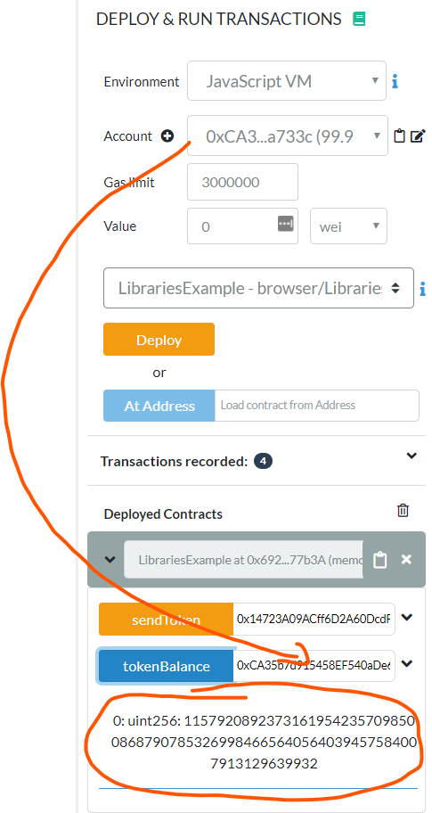
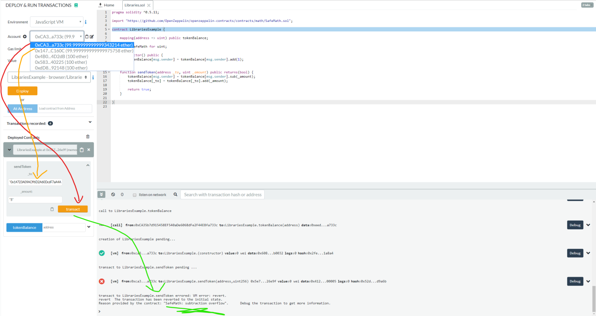

# Libraries, Using [...] for [...]

## Prerequisites

1. Chrome or Firefox browser.
2. An Internet connection
3. Open Remix with the following Smart Contract:

```js
// SPDX-License-Identifier: MIT

pragma solidity ^0.7.1;

contract LibrariesExample {
    mapping(address => uint256) public tokenBalance;

    constructor() {
        tokenBalance[msg.sender] = 1;
    }

    function sendToken(address _to, uint256 _amount) public returns (bool) {
        tokenBalance[msg.sender] -= _amount;
        tokenBalance[_to] += _amount;
        return true;
    }
}
```

## Step by Step Instruction

### Deploy the Smart Contract in the JavaScript VM

- Open the “Deploy and Run Transactions” view in Remix with the smart contract. Deploy the Smart Contract!

### Send 2 Token to any account

- Send 2 token to any other account than the selected one and observe what happens with the tokenBalance. We already talked about Wrap Around, but there is maybe a better way to tackle this than through a lot of assert statements...




### Import a Library

- Now we are going to import a library, such as the “SafeMath” Library from OpenZeppelin:

https://github.com/OpenZeppelin/openzeppelin-contracts/blob/release-v3.4/contracts/math/SafeMath.sol

- In Remix we can conveniently import it into our smart contract:

```js
// SPDX-License-Identifier: MIT

pragma solidity ^0.7.1;

import "https://github.com/OpenZeppelin/openzeppelin-contracts/blob/release-v3.4/contracts/math/SafeMath.sol";

contract LibrariesExample {
    using SafeMath for uint256;
    mapping(address => uint256) public tokenBalance;

    constructor() {
        tokenBalance[msg.sender] = tokenBalance[msg.sender].add(1);
    }

    function sendToken(address _to, uint256 _amount) public returns (bool) {
        tokenBalance[msg.sender] = tokenBalance[msg.sender].sub(_amount);
        tokenBalance[_to] = tokenBalance[_to].add(_amount);
        return true;
    }
}
```

### Execute the Transfer of 2 tokens again



>You will see it’s inherently not possible.

- Because the feedback for the user is very “low level” and it could be a better error message, but at least there is no Wrap Around.

### Using For vs. Not Using For

- Consider this Library and the Smart Contract:

```js
// SPDX-License-Identifier: MIT

pragma solidity ^0.7.1;

library Search {
    function indexOf(uint256[] storage self, uint256 value)
        public
        view
        returns (uint256)
    {
        for (uint256 i = 0; i < self.length; i++)
            if (self[i] == value) return i;
        return uint256(-1);
    }
}

contract NotUsingForExample {
    uint256[] data;

    function append(uint256 value) public {
        data.push(value);
    }

    function replace(uint256 _old, uint256 _new) public {
        // This performs the library function call
        uint256 index = Search.indexOf(data, _old);
        if (index == uint256(-1)) data.push(_new);
        else data[index] = _new;
    }
}
```
- Here we have one uint[] array, but to search and use the “indexOf” function we need to explicitly call the Library function.

- Consider now the following small Change:

```js
// SPDX-License-Identifier: MIT

pragma solidity ^0.7.1;

library Search {
    function indexOf(uint256[] storage self, uint256 value)
        public
        view
        returns (uint256)
    {
        for (uint256 i = 0; i < self.length; i++)
            if (self[i] == value) return i;
        return uint256(-1);
    }
}

contract UsingForExample {
    using Search for uint256[];
    uint256[] data;

    function append(uint256 value) public {
        data.push(value);
    }

    function replace(uint256 _old, uint256 _new) public {
        // This performs the library function call
        uint256 index = data.indexOf(_old);
        if (index == uint256(-1)) data.push(_new);
        else data[index] = _new;
    }
}
```

- As you can see, the small change made it possible to use the library in the context of the uint array itself.

- This is directly from the example in the solidity docs: https://docs.soliditylang.org/en/v0.7.1/contracts.html#libraries

### Congratulations!!