# Download, Install and Configure MetaMask

## Prerequisites:
1. Chrome or Firefox browser.
2. An Internet connection

Open [https://metamask.io](https://metamask.io) and download the plugin for your browser.

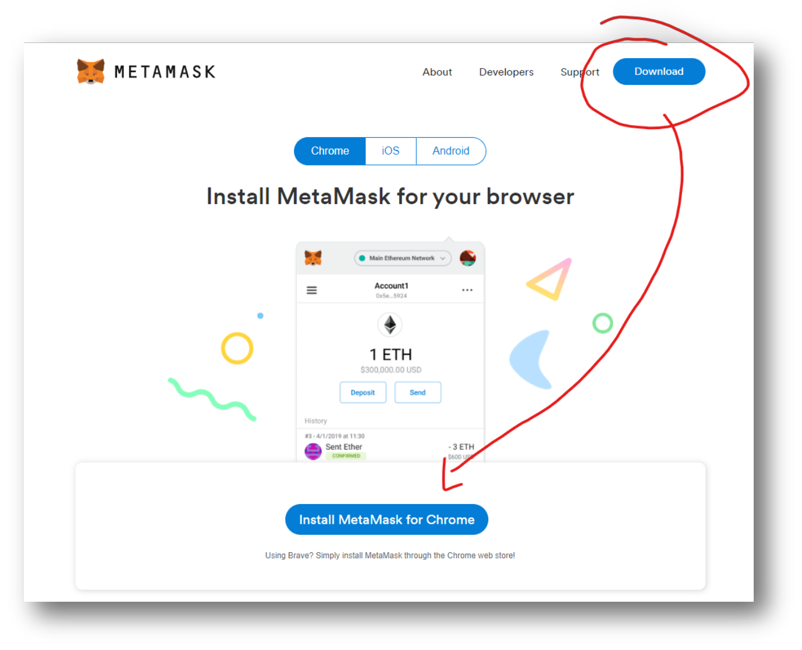

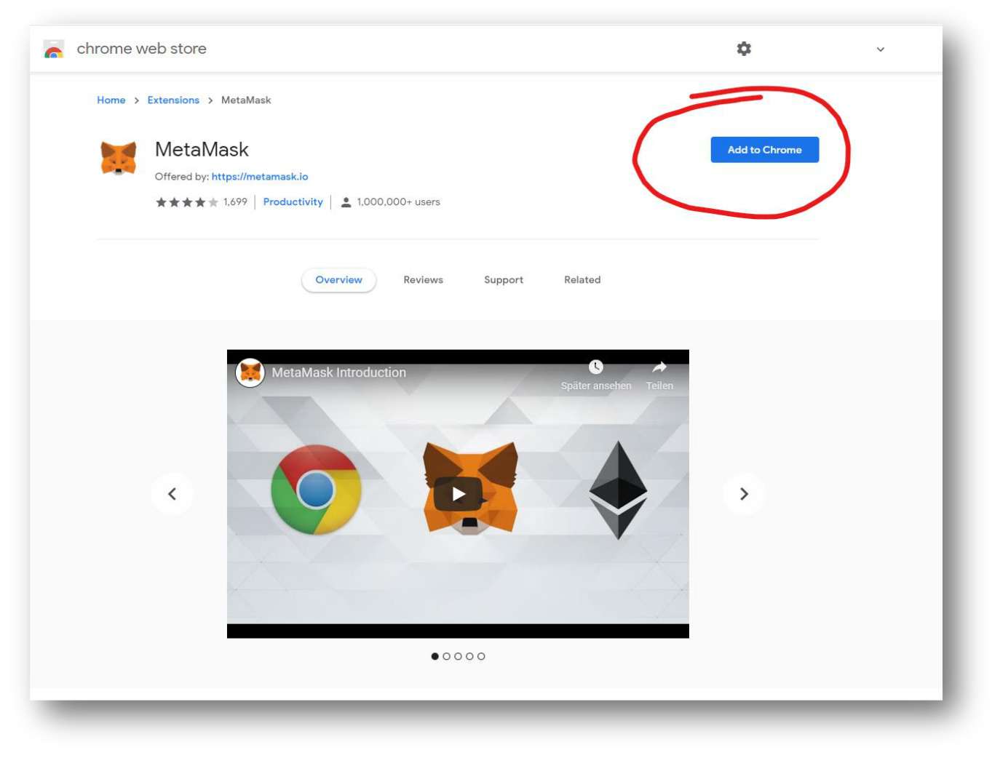

## Setup MetaMask

MetaMask will automatically open up a “setup” page. Hit “Begin” and walk through the setup-wizard.

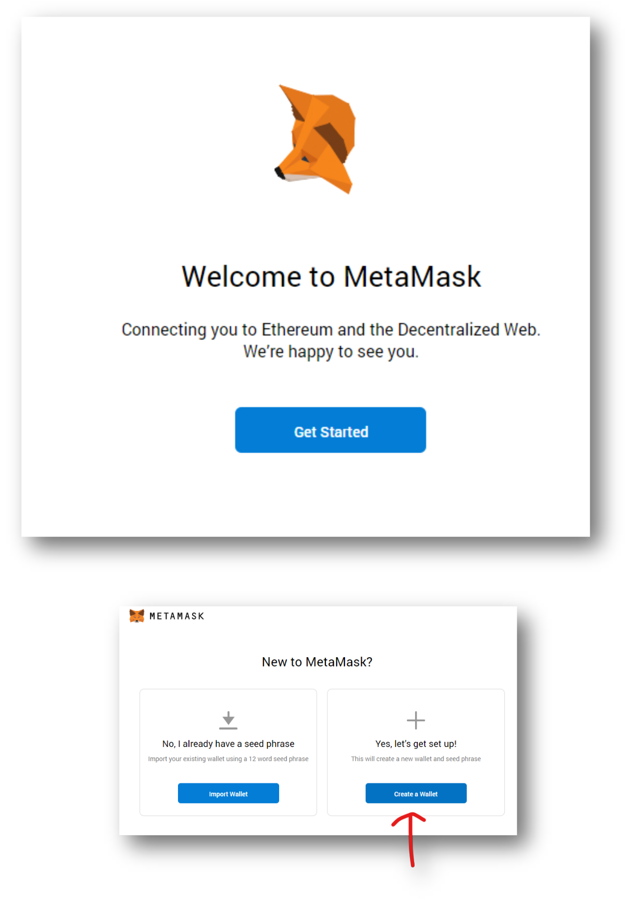

- If you want to send statistical information, is totally up to you, both is fine:

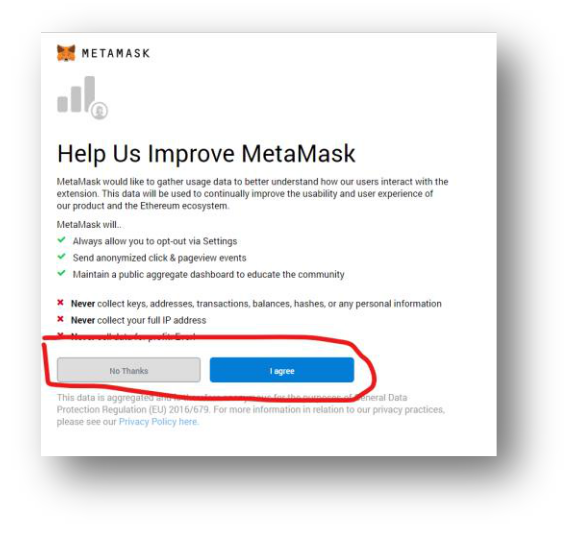

- Create a new strong password. This password is used to encrypt your private keys. What private keys are
exactly is discussed in a later section of the course, suffice to say though, they give access to all your
Ether. So, better have a strong password here:

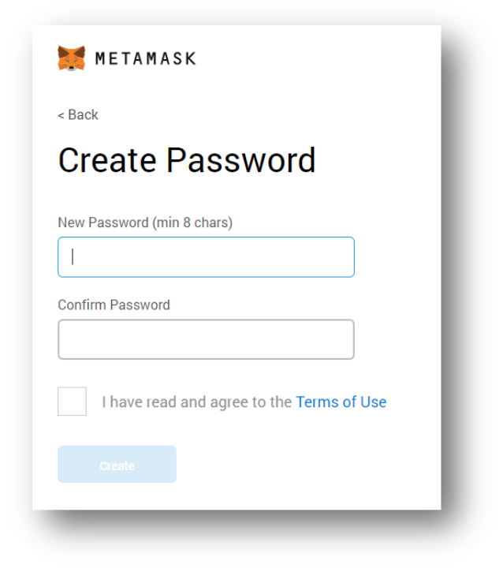

- If you are just planning to use MetaMask within this course and not hold any real-world assets for now,
then skip the next step. Of course, it would be better to safely store the secret phrase, but for sake of
simplicity, let’s just skip this for now:

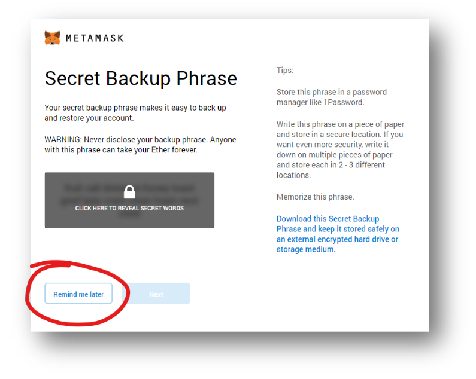

And you should be greeted with this screen:

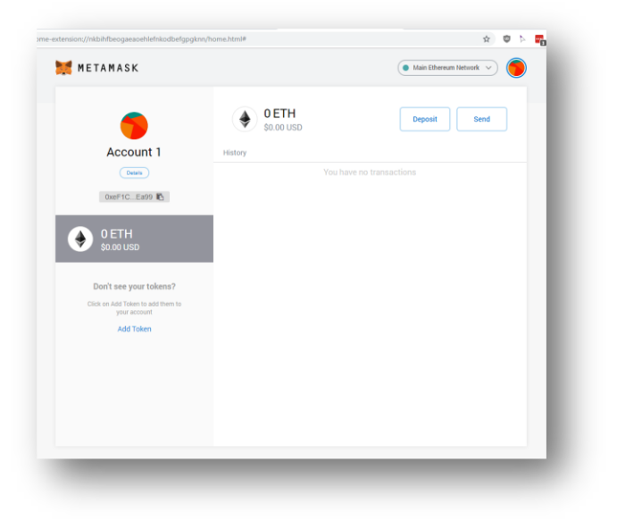

## Use MetaMask to transfer Ether
- Switch the network to Goerli. 
>Attention here: some of the pictures have “Ropsten” selected, but the Ropsten test-network had a couple of hiccups, so I recommend Goerli instead!

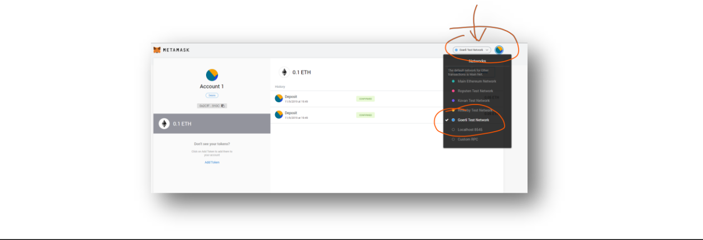

- Hit **Deposit**

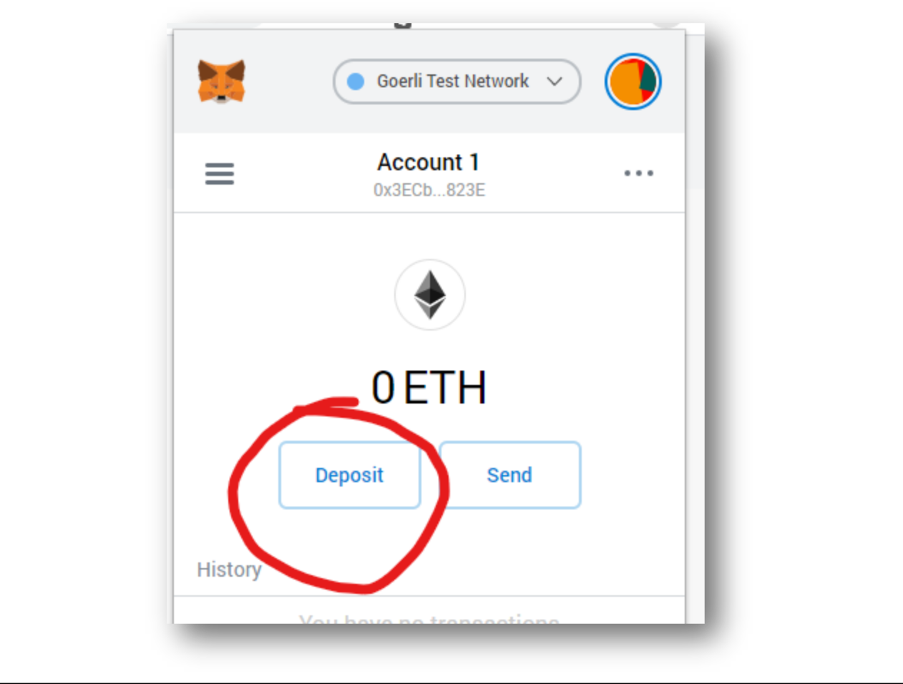

- Click on **Get Ether**

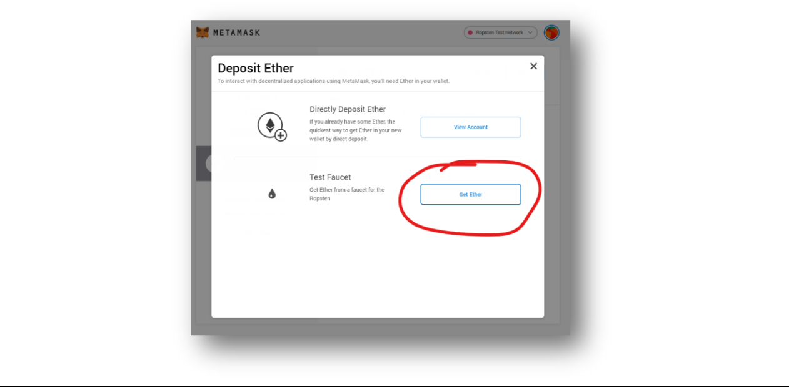

- A new website should open up. That’s the faucet to get Ether. A Faucet is like a “get free Ether” – site.
The Ethers are having no value, they are running under a “test” Blockchain, but they are great for getting
 your feet wet with transactions and how Wallets work.

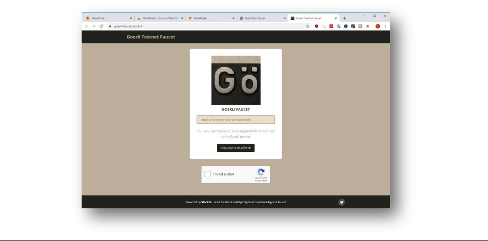

- Copy your Address from MetaMask

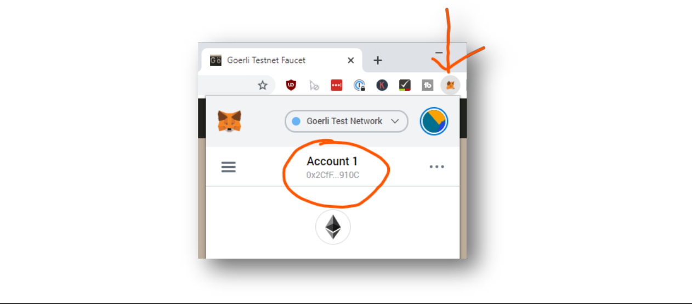

- Paste it into the Goerli Faucet Value Field and hit “I’m not a robot” and “Request 0.05 GÖETH”

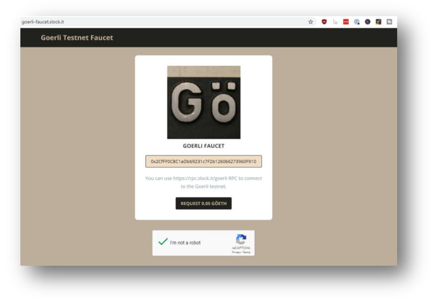

- Wait until the popup appears...

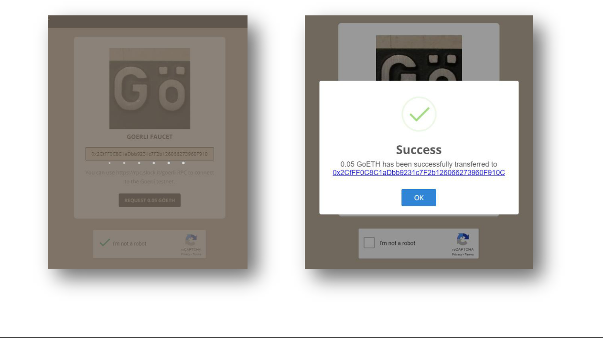

- Click on the link of the transaction and a new tab should pop up to Etherscan.io showing you the details of your transaction.

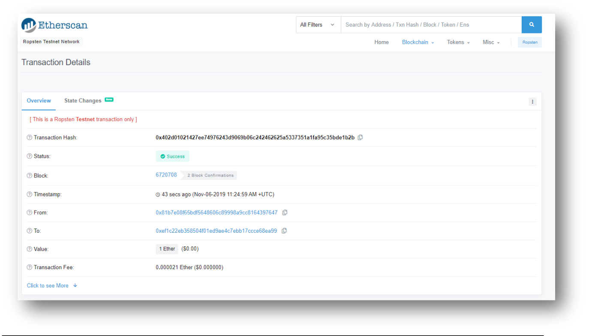

- Now open MetaMask from your browser and you should see some ETH in your wallet on a test-net.
> Note: I have 0.15ETH in my wallet, because I did this procedure 3 times for the screenshots.

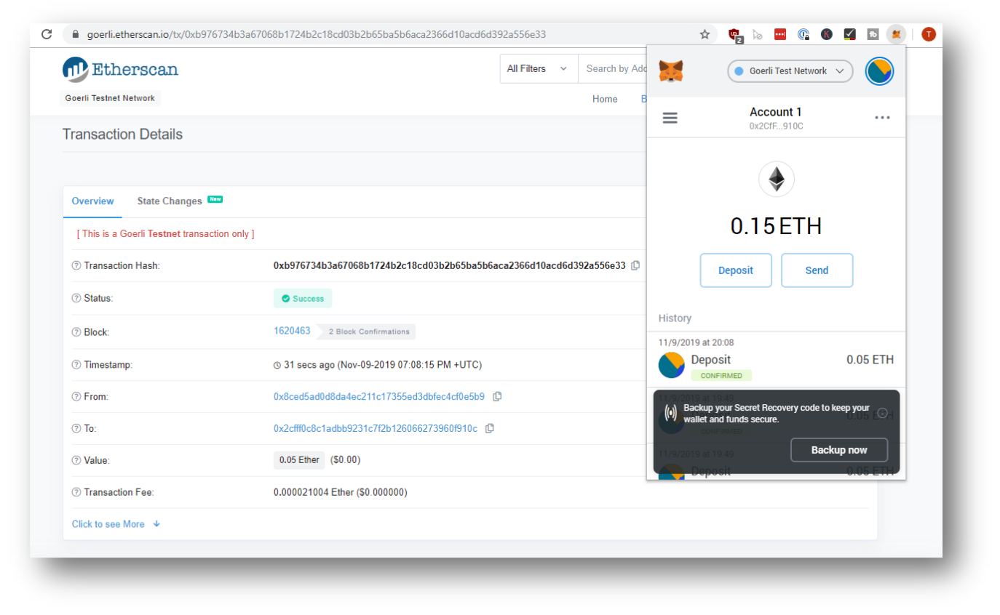

## Alternative Testnet Faucets
There are many more testnet faucets than what is shared in Metamask. Sometimes there are limited
amount of Ether that a faucet can provide per user or per day. You can google search for more testnet
faucets. Here are some alternative testnet faucets.

- Ropsten [https://faucet.ropsten.be/](https://faucet.ropsten.be/)
- Kovan [https://gitter.im/kovan-testnet/faucet](https://gitter.im/kovan-testnet/faucet)
- Rinkeby [http://rinkeby-faucet.com/](http://rinkeby-faucet.com/)
- Goerli [https://faucet.goerli.mudit.blog/](https://faucet.goerli.mudit.blog/)
- Universal faucet [https://faucets.blockxlabs.com](https://faucets.blockxlabs.com)

#### Congratulations, you downloaded, installed and configured MetaMask!