# Remix to create smart contract

## Prerequisites
1. Chrome or Firefox browser.
2. An Internet connection
3. MetaMask Plugin connected to the Test-Net
4. Some Funds in your Account

## Step by Step Instruction

### Creating first smart contract

- Open Remix at [https://remix.ethereum.org](http://remix.ethereum.org).
> It opens dark mode theme as default.

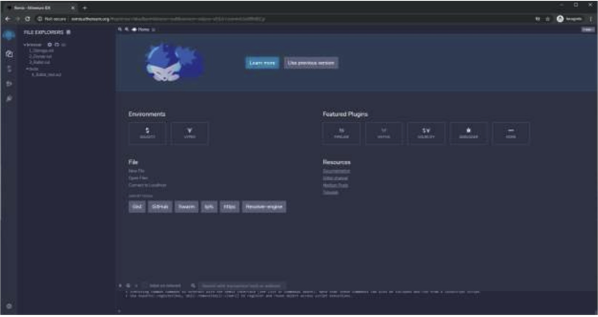

- You can use any theme you like. Click the Setting icon at the bottom left, scroll down, and choose whatever theme you like. | chose Flatly theme.

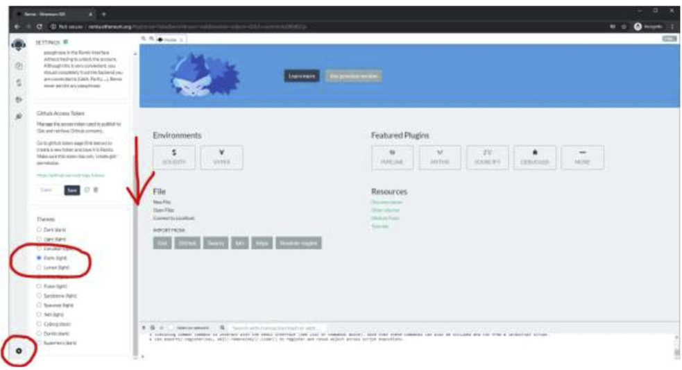

### Enable the right plugins

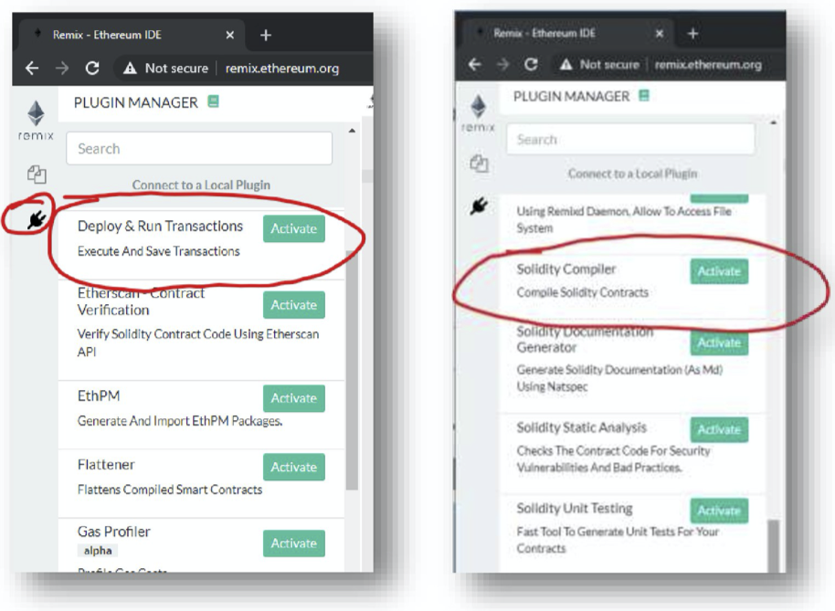

### Create new file

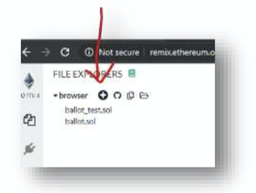

### Name it `MyContract.sol`

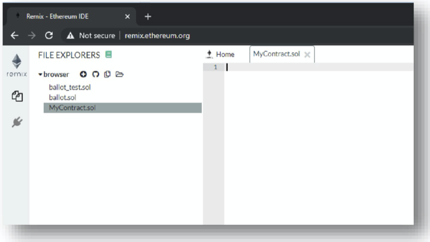

### Add some code

```js
// SPDX-License-Identifier: MIT

pragma solidity ^0.6.10;

contract MyContract {

    string public myString = ‘hello world!';
}
```

### Make sure AutoCompile Is set to true

Set **Auto compile** to true, so you don’t have to compile your smart contracts before deployment all the
time. Setting this to true is very very handy for smaller projects.

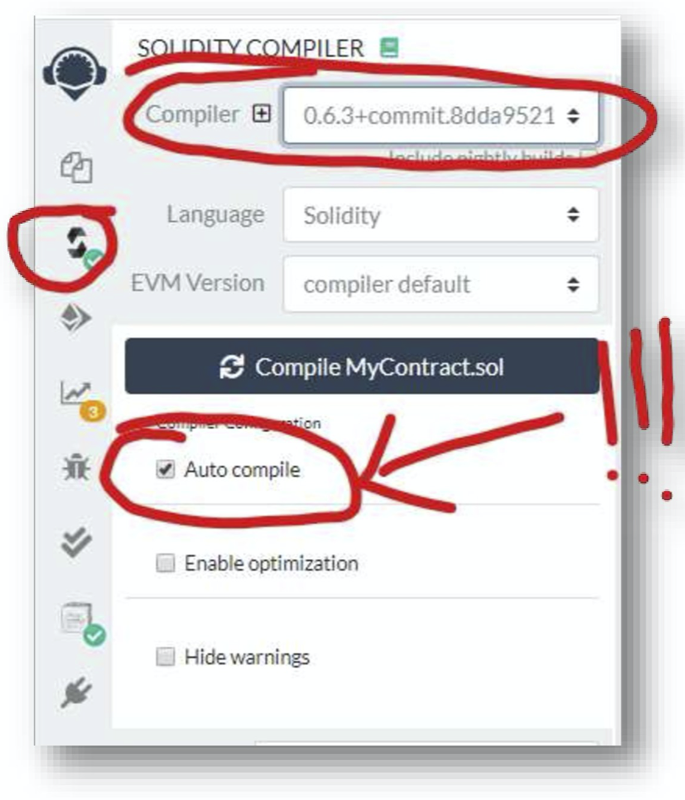

### Select the right environment to deploy it on the Blockchain

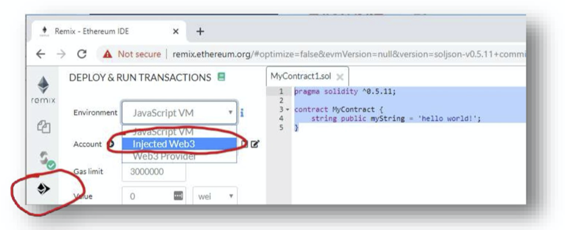

### Connect MetaMask to remix

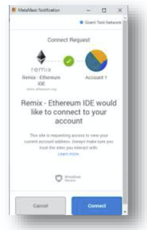

### Deploy the smart contract

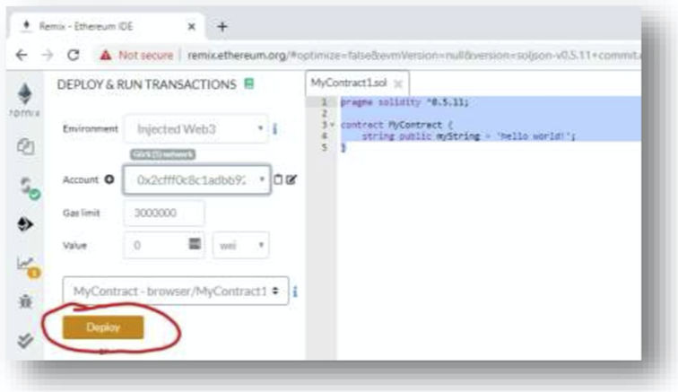

### Confirmation the transaction

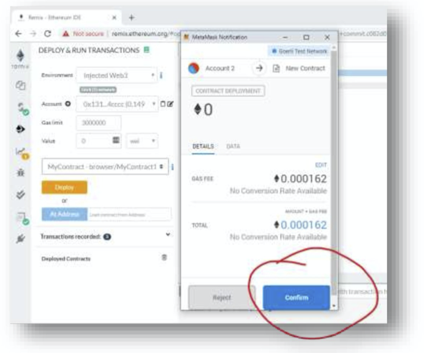

### Wait until transaction is confirmed

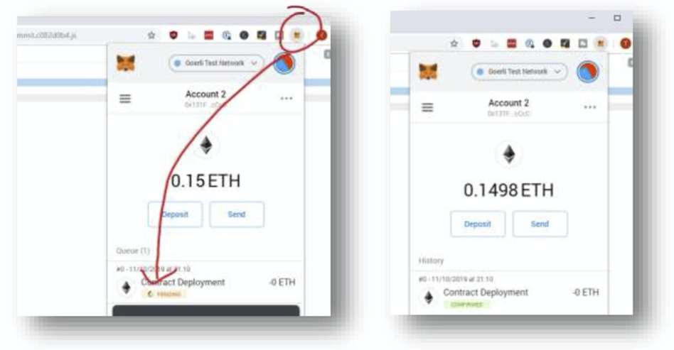

### Imteract with new contract

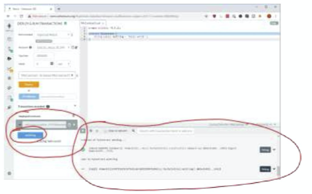

#### Congratulations! You created, deployed and interacted with a simple contract using remix

## Submission

 - Submit the etherscan link that deployed `MyContract.sol`.