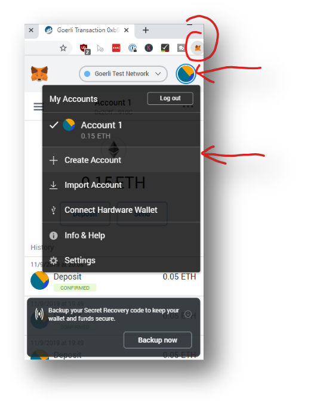
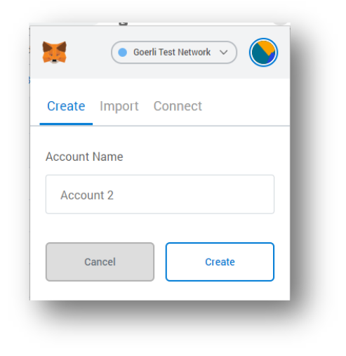
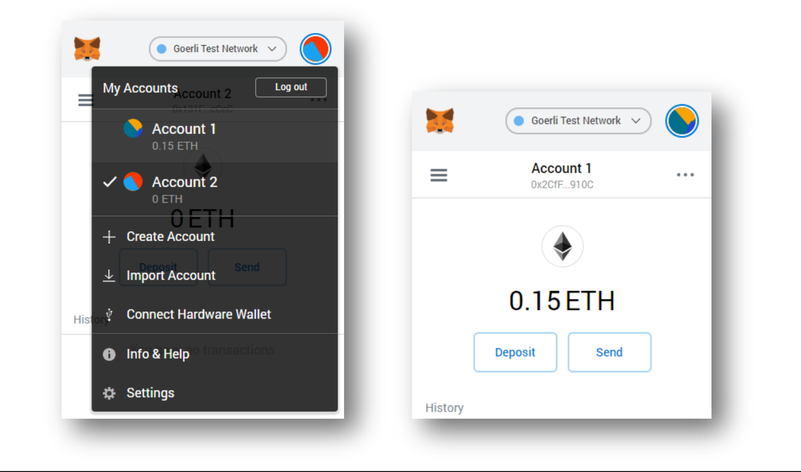
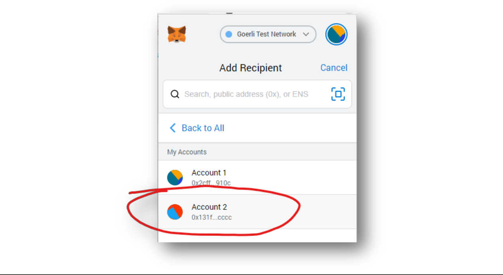
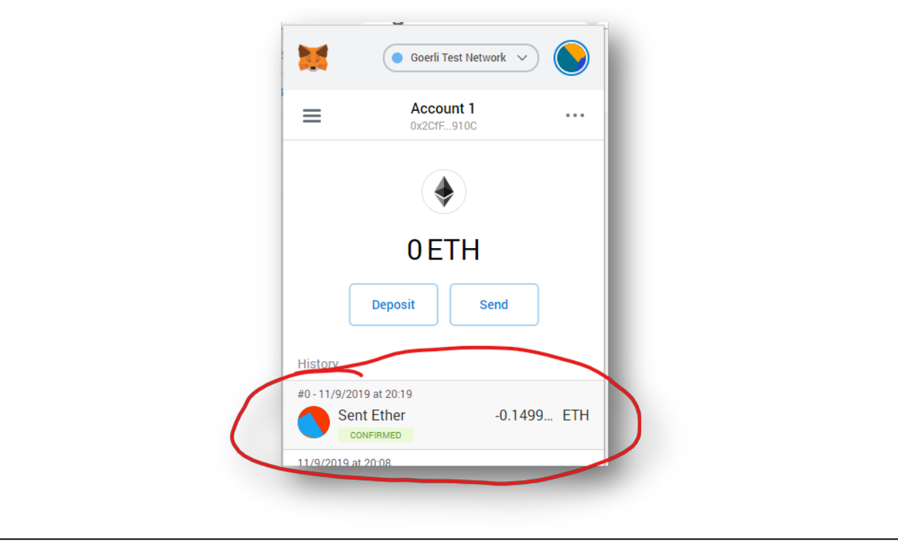
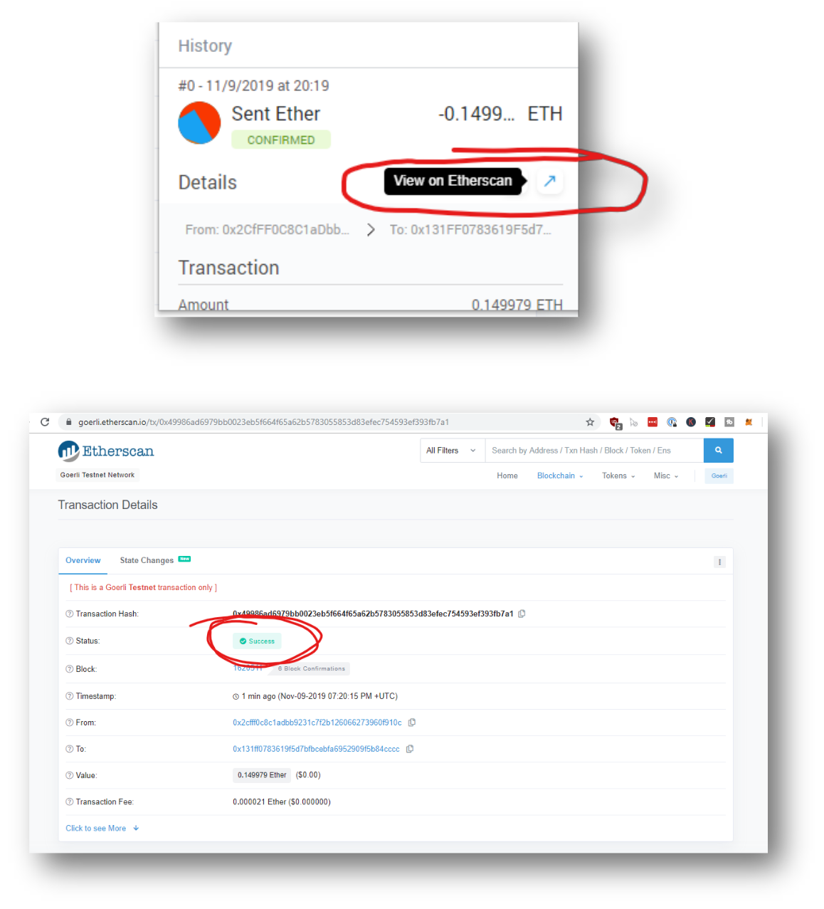

# Transfering Ether between two accounts

## Prerequisites:
1. Chrome or Firefox browser.
2. An Internet connection
3. MetaMask Plugin connected to the Test-Net from the previous Lab
4. Some Funds in your Account

## Steps to follow

### Sending Ether from Account 1 to Account 2
- Open MetaMask and add a new Account:

- We name it “Account 2”, as suggested:

- Hit the “Send” Button and select “Transfer between my accounts”

- Select the “Account 2” as the recipient: 

- Select “MAX” in the send window and hit “Next” and “Confirm”

- Wait until the Transaction comes up as “Confirmed”:

 
- Click on the Transaction to open EtherScan and check the status:

## Submission

 - Submit the etherscan link that represents above transaction between Account1 and Account2
 
