# Use different blockchain networks

## Prerequisites
1. Chrome or Firefox browser.
2. An Internet connection
3. MetaMask Plugin connected to the Test-Net
4. Some Funds in your Account

### Add the following Smart Contract in Remix:

```js
// SPDX-License-Identifier: MIT

pragma solidity ^0.7.1;

contract MyContract {

    string public myString = "hello world!";
}
```

## Step by Step Instruction

### Deploy the Smart Contract to a Real Blockchain

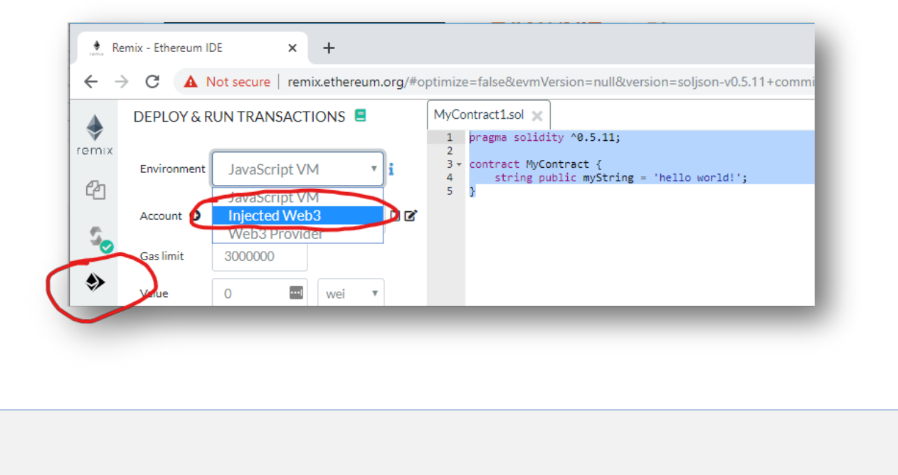

### Connect MetaMask to Remix

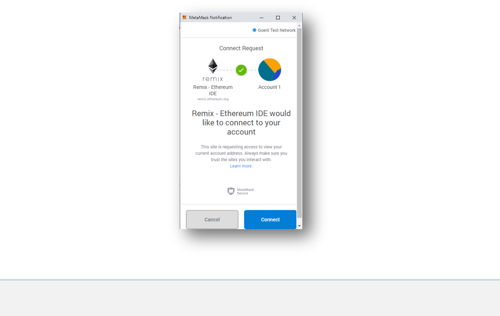

### Deploy the Smart Contract:

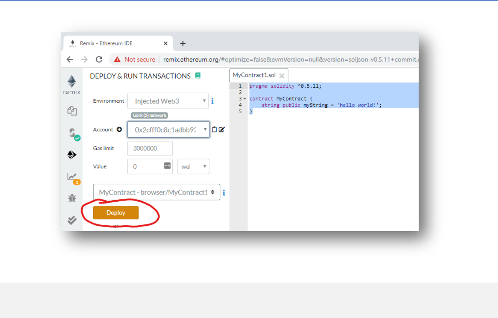

### Confirm the Transaction:

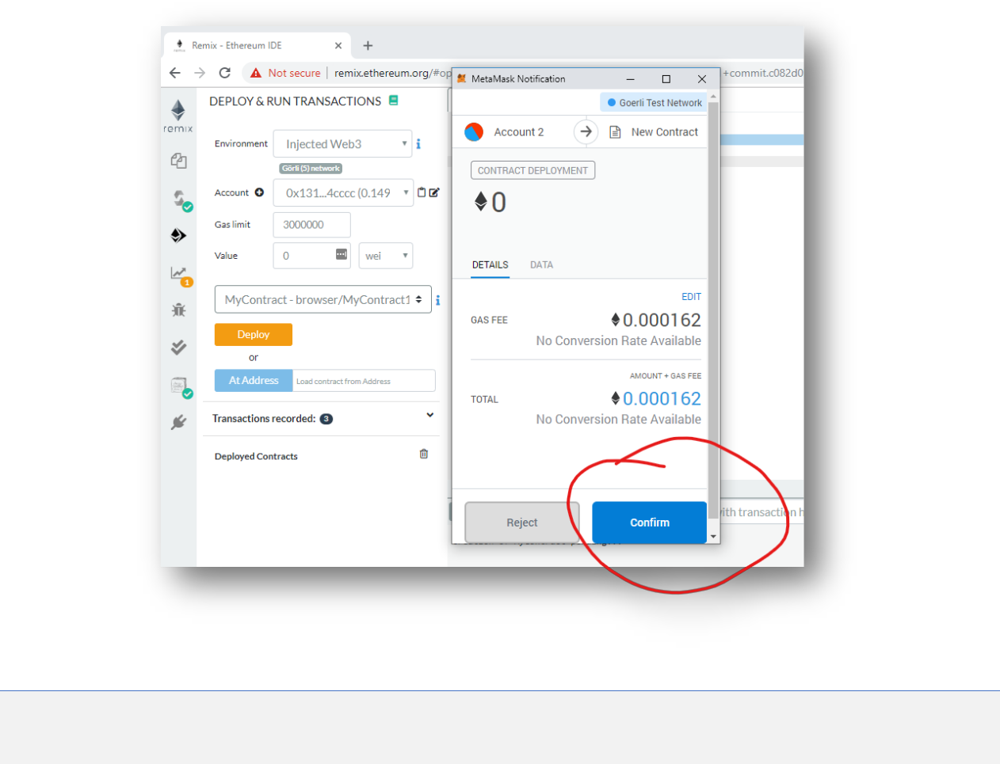

### Wait until the Transaction comes up as “Confirmed”:

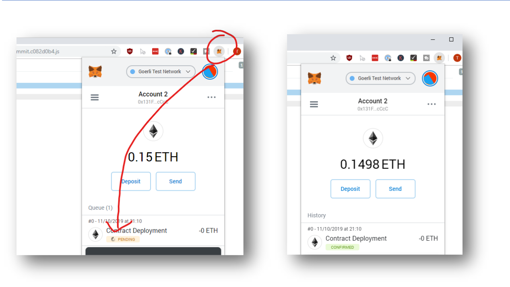

### Interact with your new Smart Contract:

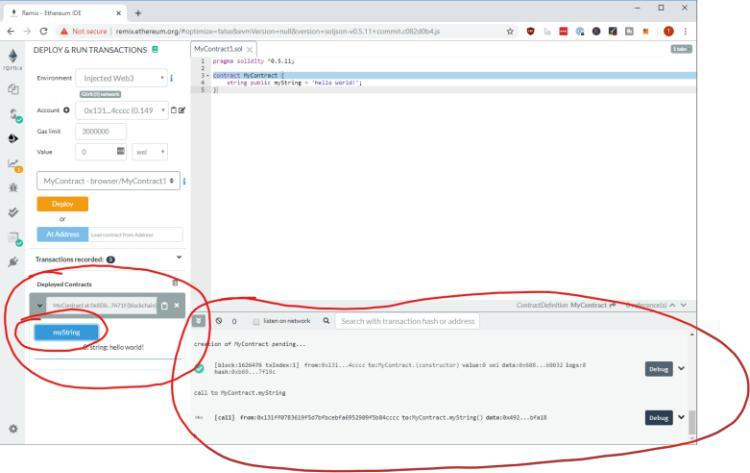

- This takes time and is cumbersome. There is a better way to do that.
- There are developer blockchains – made for quickly developing “stuff” without actual participants or mining overhead.

### Change the Environment to JavaScript VM

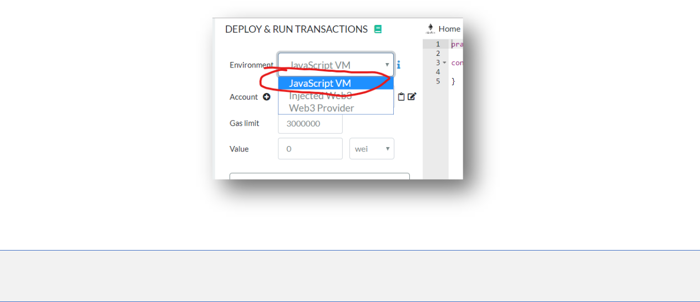

### Deploy the Smart Contract

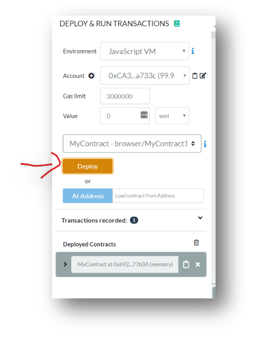

- No MetaMask window pops up and also no time to wait until the transaction is mined.
- Very handy for a blockchain developer. But also, it’s hard, because you can’t really look into the current blocks, there is no overview or something similar. Everything is in the browser.

### Download Ganache and run “Quickstart”

- Go to [https://www.trufflesuite.com/ganache](https://www.trufflesuite.com/ganache) and download Ganache for your Operating System.

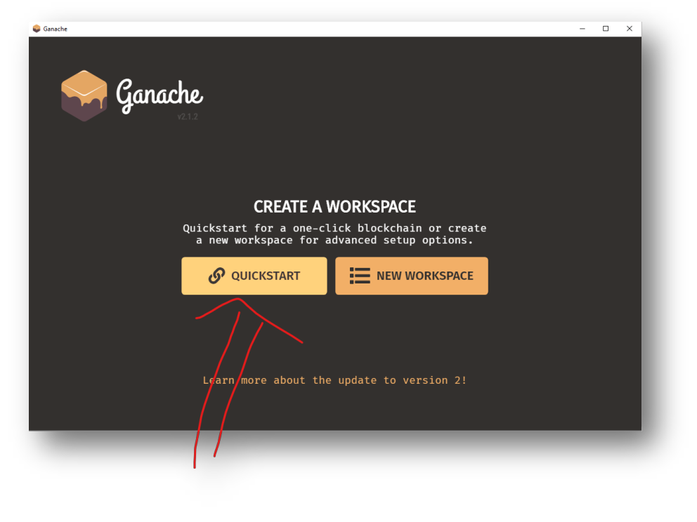

### Wait until it spins up a local dev-blockchain

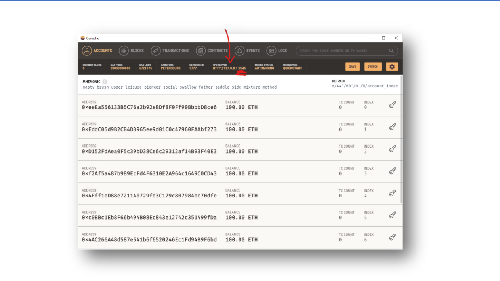

Remember the address and the port.

### Connect your browser directly to Ganache


- And enter the address + the port from ganache:

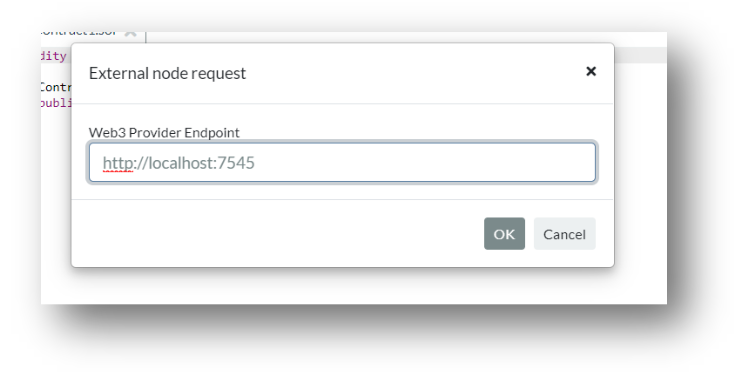

- Observe that the accounts-dropdown has the same accounts as Ganache.

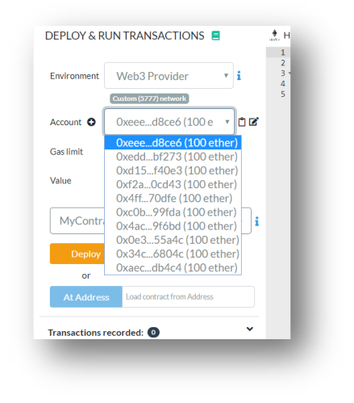

### Deploy your smart contract to Ganache

- Also observe that a transaction sent to Ganache let’s you dig deeper into the actual transaction data:

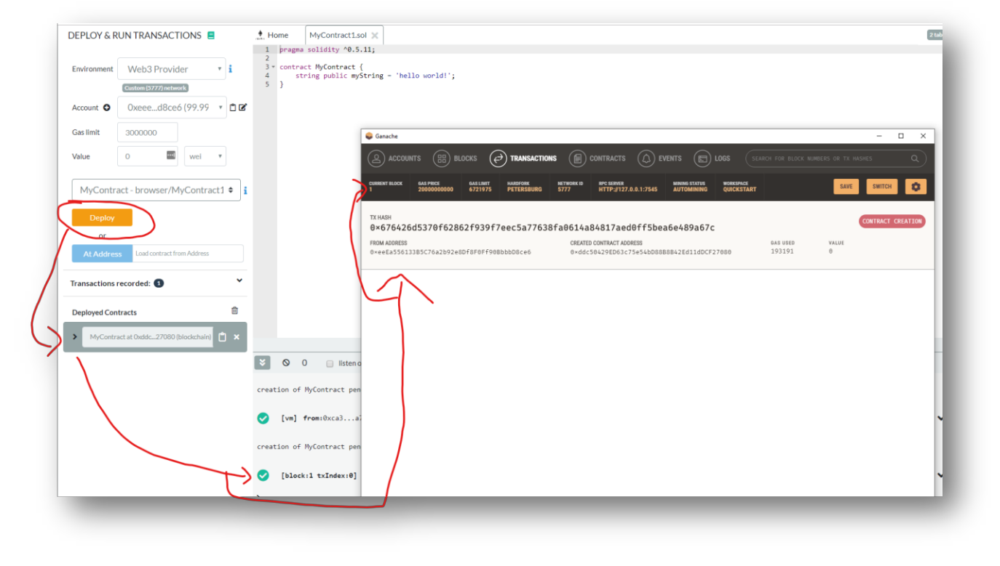

- Going forward it’s probably best to use either the JavaScript VM or Web3 Provider with Ganache. The choice is yours, whatever you prefer.