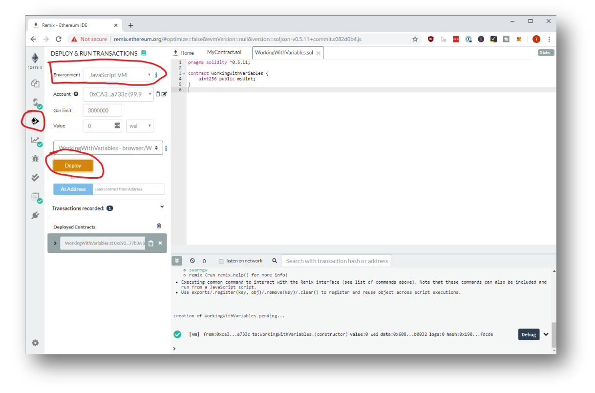
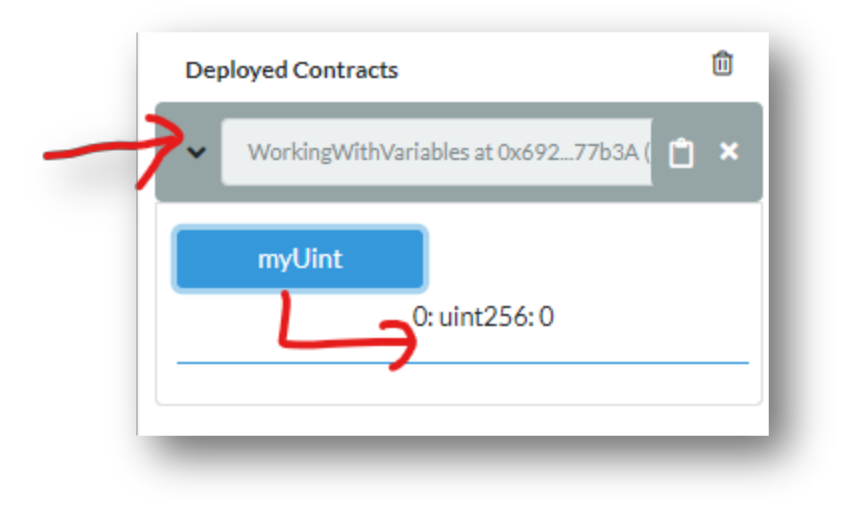
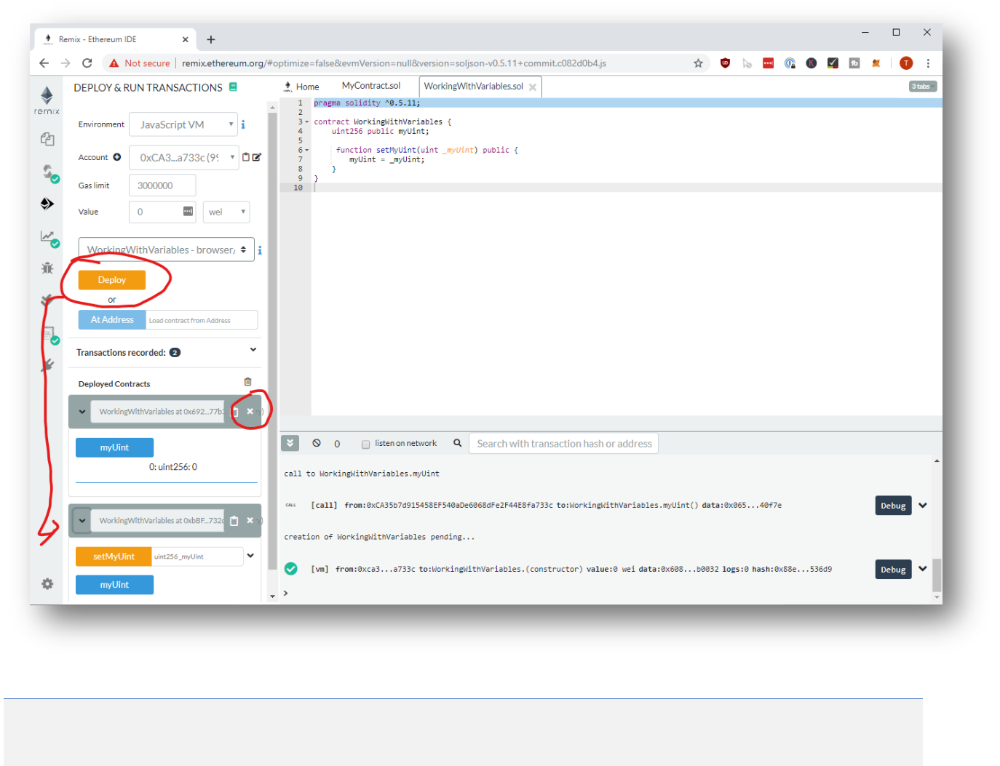
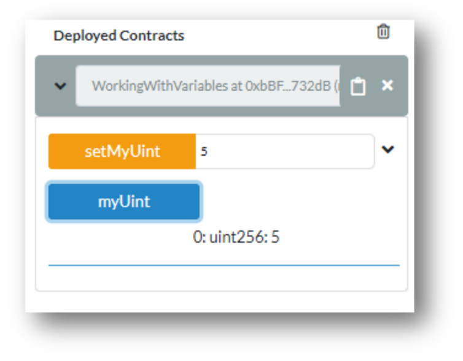
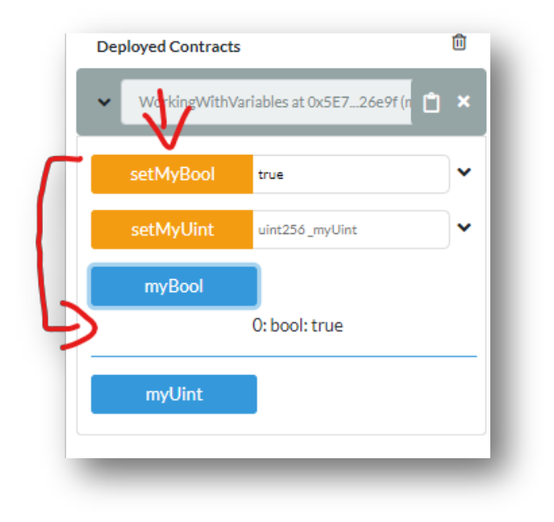
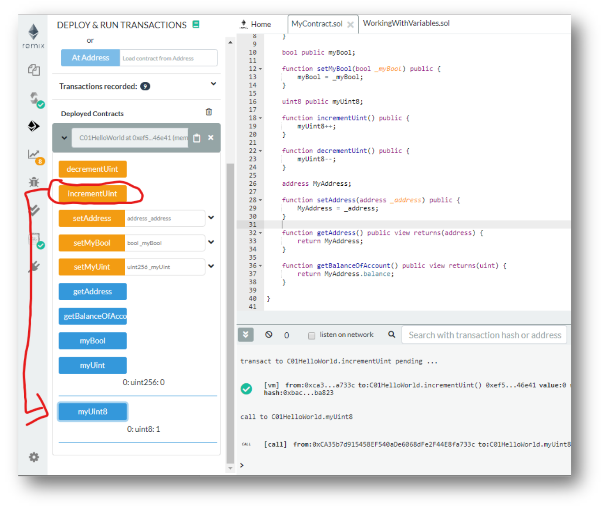
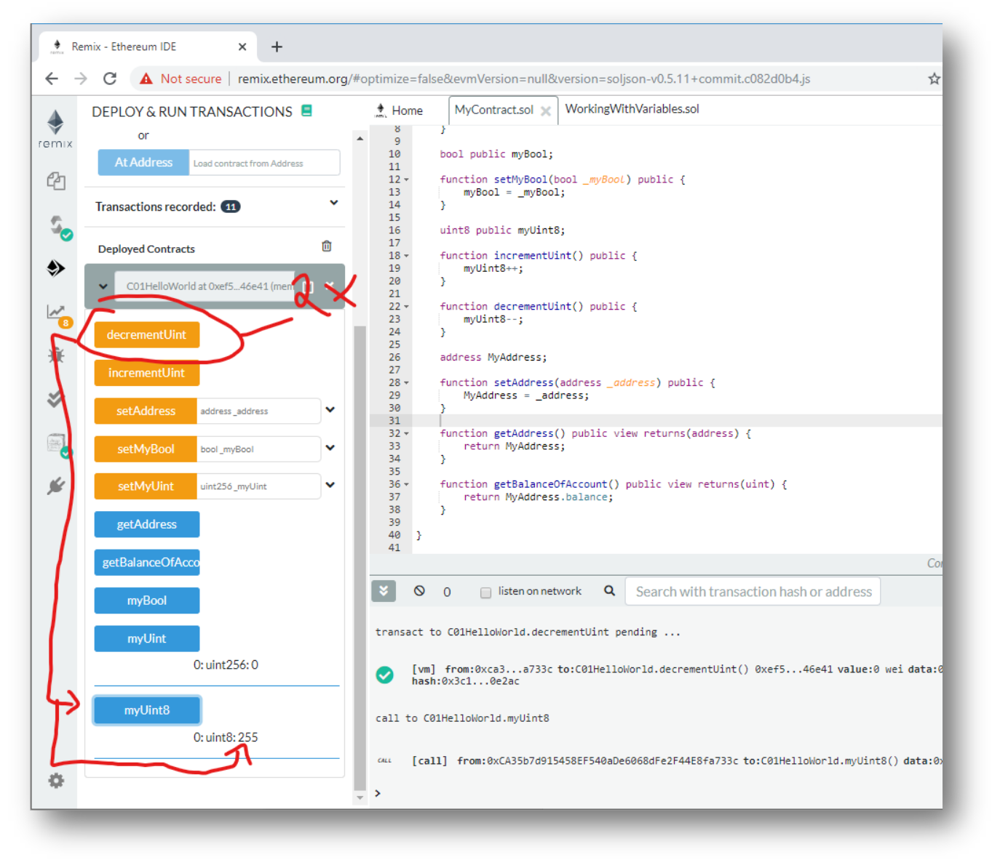
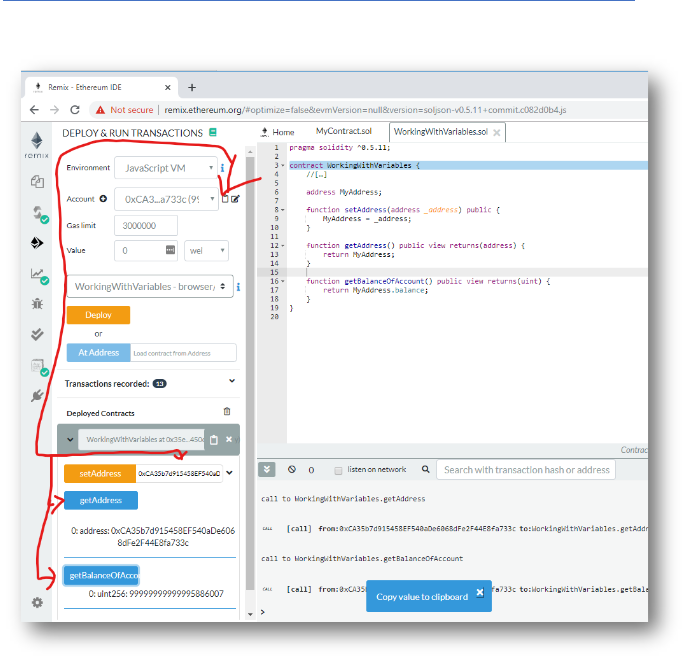
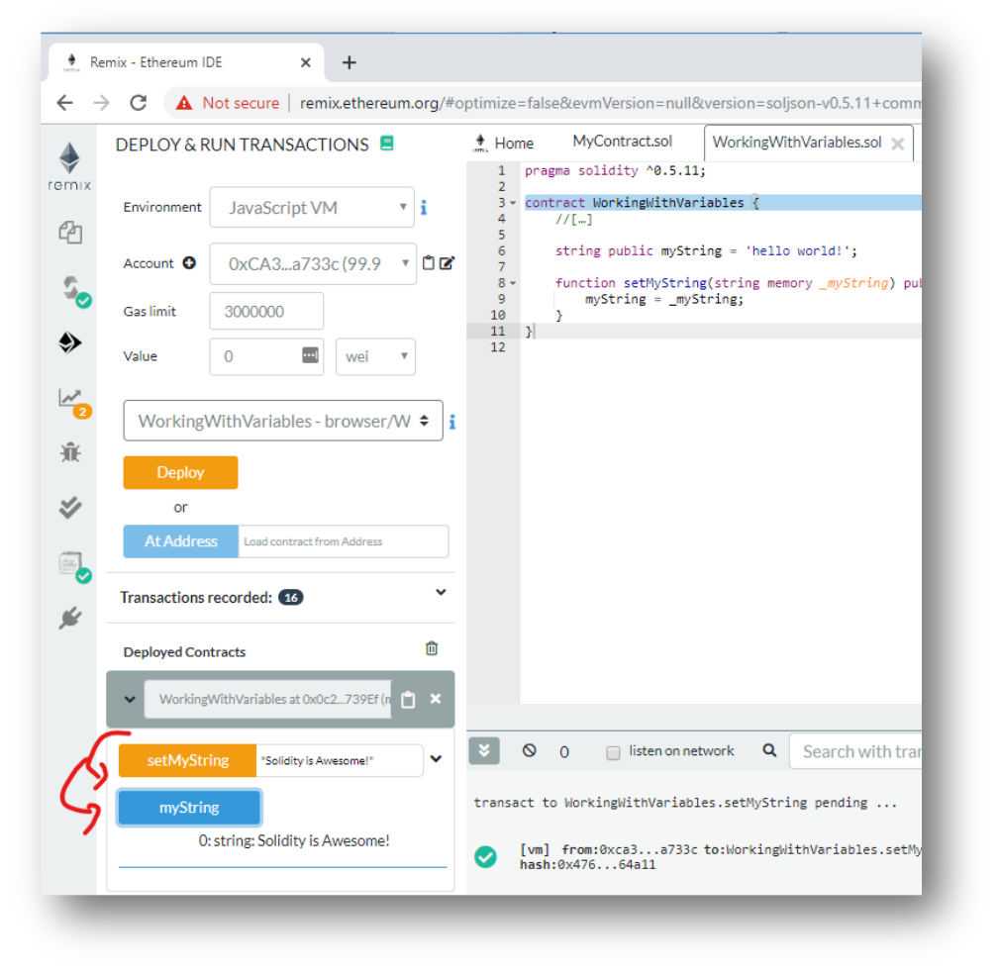

# Working with Variables

## Prerequisites
1. Chrome or Firefox browser.
2. An Internet connection

### Open Remix with the following Smart Contract:

```js
// SPDX-License-Identifier: MIT

pragma solidity ^0.7.1;

contract WorkingWithVariables {
    uint256 public myUint;
}
```

## Step by Step Instruction

### Deploy the Smart Contract in the JavaScript VM

Open the **Deploy and Run Transactions** view in Remix with the smart contract



### Interact with the Smart Contract

Now we are reading the myUint, although it has not been initialized:



### We add a Setter-Function

```js
// SPDX-License-Identifier: MIT

pragma solidity ^0.7.1;

contract WorkingWithVariables {
    uint256 public myUint;

    function setMyUint(uint _myUint) public {
        myUint = _myUint;
    }
}
```

### Deploy a new version of the smart contract

First you need to deploy a new version of the smart contract and you can close the previous Instance:




### Set the Integer and get the result



### Add a Boolean and Interact with it

Don’t forget to deploy a new instance before it appears:

```js
// SPDX-License-Identifier: MIT

pragma solidity ^0.7.1;

contract WorkingWithVariables {
    uint256 public myUint;

    function setMyUint(uint _myUint) public {
        myUint = _myUint;
    }

    bool public myBool;
    
    function setMyBool(bool _myBool) public {
        myBool = _myBool;
    }
}
```



### Add a `uint8` and increment/decrement functions

- `uint8` ranges from 0 to 255. We add two functions to increment and decrement the variable.

```js
// SPDX-License-Identifier: MIT

pragma solidity ^0.7.1;

contract WorkingWithVariables {
    uint256 public myUint;

    function setMyUint(uint _myUint) public {
        myUint = _myUint;
    }

    bool public myBool;

    function setMyBool(bool _myBool) public {
        myBool = _myBool;
    }

    uint8 public myUint8;

    function incrementUint() public {
        myUint8++;
    }

    function decrementUint() public {
        myUint8--;
    }
}
```



### Observe Overflow and Underflow

- With Solidity you have to be careful about overflows and underflows. There are no warnings!
- Decrement the `uint` to “-1” and observe it automatically rolls over to 255:



### Add a Variable of the type “Address”

```js
// SPDX-License-Identifier: MIT

pragma solidity ^0.7.1;

contract WorkingWithVariables {
    //[…]
    address public myAddress;

    function setAddress(address _address) public {
        myAddress = _address;
    }

    function getBalanceOfAccount() public view return (uint) {
        return myAddress.balance;
    }
}
```

### Set the Address to the address of your Account



### Add a String

```js
// SPDX-License-Identifier: MIT

pragma solidity ^0.7.1;

contract WorkingWithVariables {
    //[…]
    string public myString = "hello world!";

    function setMyString(string memory _myString) public {
        myString = _myString;
    }
}
```



#### Congratulations!